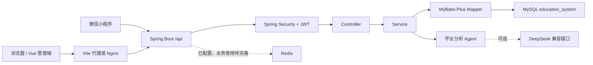

# 校园教务管理系统

基于 Java 8、Spring Boot 2.7、Spring Security、MyBatis-Plus、MySQL、Redis、JWT、Vue 3、Docker Compose 的校园教务管理系统。当前仓库是单体 Spring Boot 后端 + Vue 3 管理端 + 微信小程序学生端的项目结构，不是微服务项目。

## 项目状态

| 模块 | 状态 | 说明 |
|---|---|---|
| 后端 API | 已实现 | 认证、用户角色、学生、教师、课程、选课、成绩、考勤、请假、排课、毕业审核、学业预警、Agent 等模块 |
| Vue 管理端 | 已实现/持续完善 | 使用 Vue 3、Vue Router、Vuex、Element Plus |
| 微信小程序 | 开发中 | 已有登录、课表、成绩、请假、个人中心等目录与请求封装 |
| 数据库脚本 | 已实现 | `backend/db/schema/schema.sql`、`backend/db/seed/seed.sql` |
| Redis | 待完善 | 已配置依赖和 Compose 服务，当前业务代码未深度使用 |
| AI 学业分析 Agent | 已实现/待完善 | 已有规则分析和可选 DeepSeek 接入，未配置 API Key 时使用降级结果 |
| Jenkins | 计划完善 | 当前仓库未发现生产级 Jenkinsfile |

## 技术栈

| 层级 | 技术 |
|---|---|
| 后端 | Java 8、Spring Boot 2.7.18、Spring Security、MyBatis-Plus、JWT、Lombok |
| 数据库 | MySQL 8.x |
| 缓存 | Redis 7 |
| 前端 | Vue 3、Vite、Vue Router、Vuex、Element Plus、Axios、ECharts |
| 测试 | JUnit 5、Mockito、Vitest、Playwright |
| 部署 | Docker Compose、Nginx、Dockerfile |

## 目录结构

```text
.
├── backend/                 # Spring Boot 后端
│   ├── pom.xml              # Maven 配置
│   ├── Dockerfile           # 后端镜像构建文件
│   ├── db/                  # 数据库 schema、seed、migration、backup
│   ├── main/java/           # 后端源码入口
│   ├── main/resources/      # application.yml 等资源配置
│   └── src/test/            # 后端测试
├── frontend/                # Vue 3 管理端
│   ├── package.json         # 前端依赖与脚本
│   ├── vite.config.js       # Vite 配置与 /api 代理
│   ├── playwright.config.js # Playwright E2E 配置
│   └── src/                 # 前端源码
├── miniprogram/             # 微信小程序端
├── docs/                    # 开发文档、接口文档、测试文档、原型资料
├── docker-compose.yml       # MySQL、Redis、后端、前端编排
└── nginx.conf               # 前端静态资源与 /api 反向代理
```

## 快速启动

### 1. 初始化数据库

Spring Boot 当前不会自动初始化数据库，需要手动执行 SQL，或通过 Docker Compose 初始化。

```text
backend/db/schema/schema.sql
backend/db/seed/seed.sql
```

### 2. 配置环境变量

不要提交真实密码、Token 或 API Key。可以创建本地 `.env`：

```text
SPRING_DATASOURCE_URL=<your-jdbc-url>
SPRING_DATASOURCE_USERNAME=<your-username>
SPRING_DATASOURCE_PASSWORD=<your-password>
SPRING_REDIS_HOST=<your-redis-host>
SPRING_REDIS_PORT=<your-redis-port>
SPRING_REDIS_PASSWORD=<your-password>
JWT_SECRET=<your-secret-at-least-32-bytes>
DEEPSEEK_API_KEY=<your-optional-api-key>
```

### 3. 启动后端

```powershell
cd backend
mvn spring-boot:run
```

后端默认：

```text
http://localhost:8080/api
```

### 4. 启动前端

```powershell
cd frontend
npm install
npm run dev
```

前端开发服务器默认：

```text
http://localhost:3000
```

开发环境中，前端 `/api` 请求会代理到后端 `http://localhost:8080`。

### 5. Docker Compose 启动

```powershell
docker-compose up --build
```

Compose 会启动 MySQL、Redis、后端和 Nginx 前端服务。前端构建产物需要位于 `frontend/dist`。

## 常用命令

| 操作 | 命令 |
|---|---|
| 后端启动 | `cd backend; mvn spring-boot:run` |
| 后端测试 | `cd backend; mvn test` |
| 后端打包 | `cd backend; mvn clean package` |
| 前端启动 | `cd frontend; npm run dev` |
| 前端构建 | `cd frontend; npm run build` |
| 前端单元测试 | `cd frontend; npm run test` |
| 前端 E2E 测试 | `cd frontend; npm run test:e2e` |
| Docker 启动 | `docker-compose up --build` |

## 系统架构



后端接口统一返回结构：

```json
{
  "code": 0,
  "message": "success",
  "data": {}
}
```

## 文档入口

| 文档 | 说明 |
|---|---|
| `docs/开发文档.md` | 当前项目完整开发文档，包含架构、接口、数据库、部署、测试、已知问题 |
| `docs/api/agent-api.md` | Agent 相关接口说明 |
| `docs/database/database.md` | 数据库关系说明 |
| `docs/testing/testing.md` | 测试说明 |
| `docs/prototypes/` | 页面原型和设计参考 |

## 测试结果

当前已验证命令：

```powershell
cd backend
mvn test
```

```powershell
cd frontend
npm run test:e2e
```

已知情况：

- 后端 JUnit/Mockito 测试已配置。
- 前端 Playwright E2E 已配置。
- 前端构建或测试在部分 Windows 沙箱环境可能遇到 `spawn EPERM`，需要在正常 PowerShell 环境或具备权限的环境中执行。

## GitHub 上传 README

当前仓库中存在较多未跟踪或临时文件，建议只提交 README：

```powershell
git add README.md
git commit -m "docs: add project readme"
git push origin codex/agentagent112
```

如果需要上传到 GitHub 默认分支，请先确认远端分支策略，再合并或发起 Pull Request。

## 注意事项

- 不要提交 `.env`、真实密码、Token、Cookie、API Key。
- 不要提交 `node_modules/`、`frontend/dist/`、`backend/target/`、日志、Playwright 临时报告。
- 当前项目为单体 Spring Boot 应用，不应描述为已完成的微服务系统。
- Jenkins、Redis 深度业务缓存、部分 AI 能力仍属于待完善内容。
