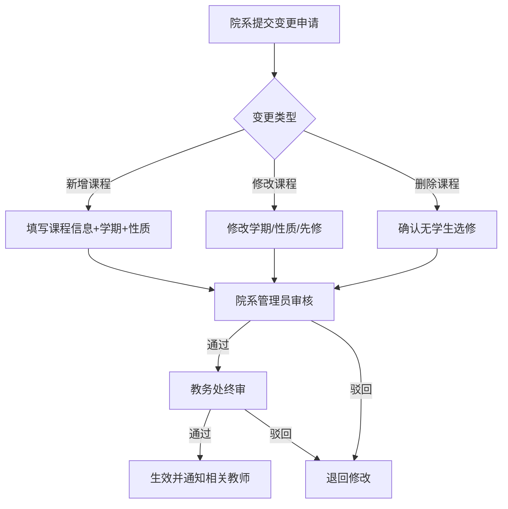

# Phase 2 设计文档：排课管理 + 教学计划

## 一、排课管理模块设计

### 1.1 手动排课交互设计（当前可落地）

**核心流程**：教务处管理员 → 选择学期 → 选择课程 → 选择教师 → 选择教室 → 设置时间 → 系统实时冲突检测 → 保存排课

**API设计**：

| API | 方法 | 说明 |
|-----|------|------|
| /schedule/page | GET | 分页查询排课列表 |
| /schedule | POST | 新增排课（含冲突检测） |
| /schedule | PUT | 修改排课 |
| /schedule/{id} | DELETE | 删除排课 |
| /schedule/check-conflict | POST | 实时冲突检测 |
| /schedule/query/by-teacher | GET | 按教师查询课表 |
| /schedule/query/by-class | GET | 按班级查询课表 |
| /schedule/query/by-classroom | GET | 按教室查询课表 |

**冲突检测SQL**（对应业务规则5B.2）：

```sql
-- 教师时间冲突检测
SELECT schedule_id, course_id, class_id
FROM course_schedule
WHERE semester_id = ?
  AND teacher_id = ?
  AND day_of_week = ?
  AND start_period <= ?  -- 新排课的end_period
  AND end_period >= ?    -- 新排课的start_period
  AND schedule_id != ?   -- 排除自身（编辑场景）

-- 教室时间冲突检测：替换 teacher_id 为 classroom_id
-- 班级时间冲突检测：替换 teacher_id 为 class_id，且 class_id IS NOT NULL
```

**前端交互**：排课表单中选择时间后，实时调用 `/schedule/check-conflict`，若有冲突则红色高亮显示冲突维度和冲突课程。

### 1.2 自动排课算法逻辑（后续迭代）

**算法选型**：约束满足问题(CSP) + 回溯搜索

```
伪代码：
function autoSchedule(courses, teachers, classrooms, semester):
    schedule = []
    sort courses by constraint_count DESC  // 约束最多的课程优先排
    
    for course in courses:
        assigned = false
        // 获取可用时间段
        slots = getAvailableSlots(semester)
        sort slots by preference_score DESC
        
        for slot in slots:
            for teacher in course.eligibleTeachers:
                for classroom in course.eligibleClassrooms:
                    if noConflict(course, teacher, classroom, slot, schedule):
                        schedule.add(course, teacher, classroom, slot)
                        assigned = true
                        break
                if assigned: break
            if assigned: break
        
        if not assigned:
            log("无法为课程 " + course.name + " 找到无冲突排课")
    
    return schedule

function noConflict(course, teacher, classroom, slot, existingSchedule):
    for s in existingSchedule:
        if s.semester == slot.semester and s.dayOfWeek == slot.dayOfWeek:
            if timeOverlap(s, slot):
                if s.teacherId == teacher.id: return false  // P0
                if s.classroomId == classroom.id: return false  // P2
                if s.classId == course.classId: return false  // P3
        if classroom.capacity < course.studentCount: return false  // P1
    return true
```

### 1.3 课表查询索引优化方案

| 查询场景 | 索引 | 说明 |
|---------|------|------|
| 按教师查课表 | idx_teacher_time(semester_id, teacher_id, day_of_week) | 已创建 |
| 按教室查课表 | idx_classroom_time(semester_id, classroom_id, day_of_week) | 已创建 |
| 按班级查课表 | idx_class_time(semester_id, class_id, day_of_week) | 已创建 |
| 开放选课课表 | idx_semester + mode='open_selection' | 复合条件 |

---

## 二、教学计划模块设计

### 2.1 教学计划与课程/专业的关联逻辑（当前可落地）

**数据模型**：teaching_plan 表（major_id + course_id 唯一约束）

**关联逻辑**：
- 每个专业(major)通过 teaching_plan 关联多门课程(course)
- 每门课程在某个专业下有明确的学期(semester_type)和课程性质(course_nature)
- 先修课程通过 prerequisite_ids 字段存储，选课时解析校验

**API设计**：

| API | 方法 | 说明 |
|-----|------|------|
| /teaching-plan/list | GET | 查询教学计划列表 |
| /teaching-plan/page | GET | 分页查询 |
| /teaching-plan | POST | 新增教学计划项 |
| /teaching-plan | PUT | 修改教学计划项 |
| /teaching-plan/{id} | DELETE | 删除教学计划项 |
| /teaching-plan/by-major/{majorId} | GET | 按专业查询培养方案 |
| /teaching-plan/check-prerequisite | GET | 校验先修课程是否满足 |

**先修课程校验逻辑**：
```sql
SELECT tp.prerequisite_ids
FROM teaching_plan tp
WHERE tp.course_id = ? AND tp.major_id = ?

-- 解析 prerequisite_ids (逗号分隔)
-- 对每个先修课程ID，检查学生是否已通过：
SELECT COUNT(*) FROM grade
WHERE student_id = ? AND course_id = ? AND status = 'approved' AND total_score >= 60
```

### 2.2 教学计划变更流程（后续迭代）



**当前可落地**：直接CRUD操作，无审批流程（管理员直接修改）。

**后续迭代**：引入审批流，变更记录留痕（audit_log），支持培养方案版本管理。
