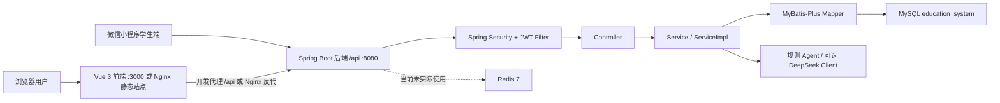
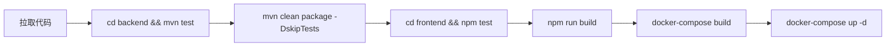
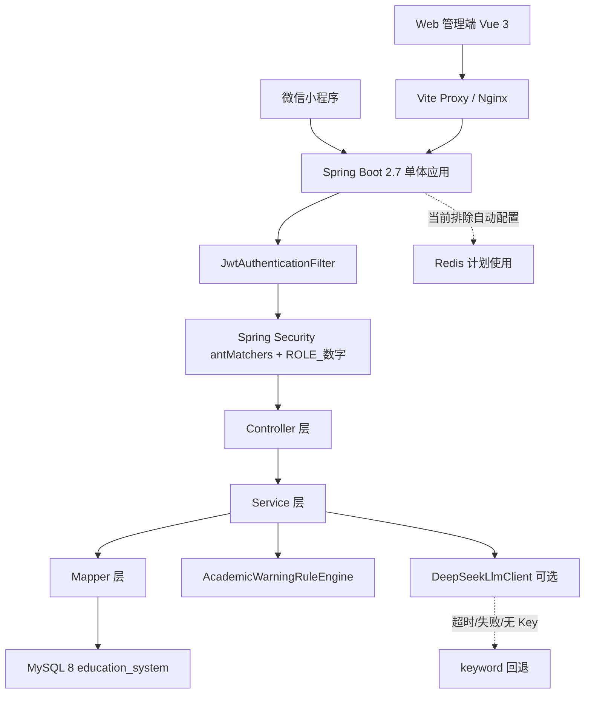
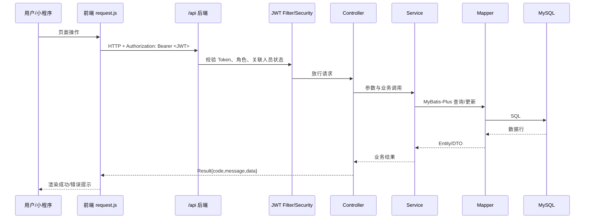
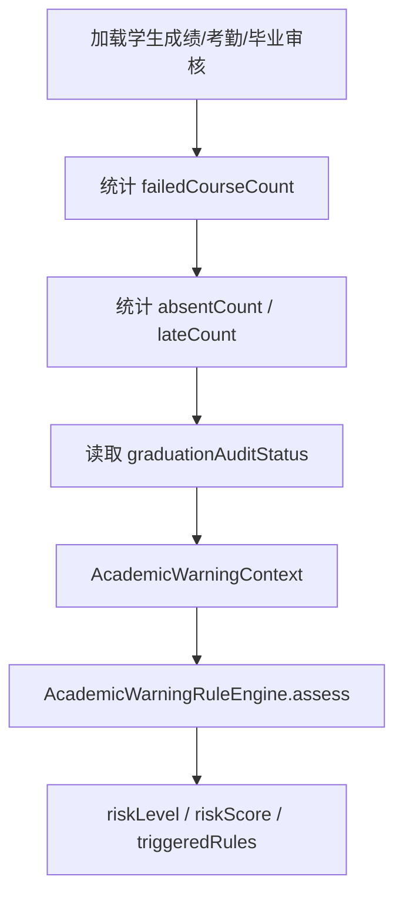
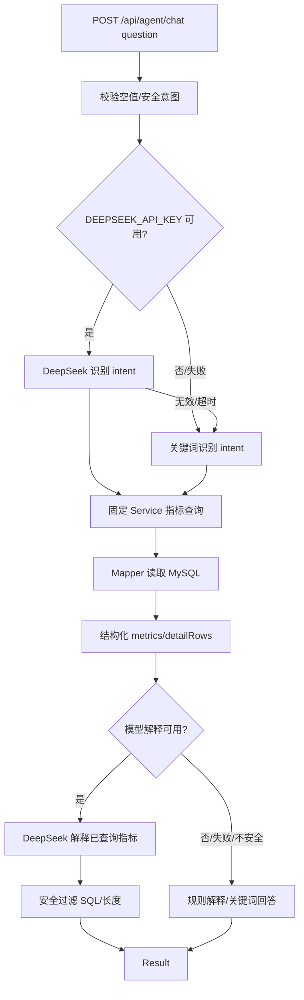

# 《开发文档》

## 一、项目概览

本项目是校园教务管理系统，当前仓库实现为**单体 Spring Boot 后端 + Vue 3 管理端 + 微信小程序学生端 + MySQL 数据库 + Docker Compose 部署编排**。后端不是微服务项目，源码入口位于 `backend/main/java/com/campus/education/EducationSystemApplication.java`，Maven 通过 `backend/pom.xml` 显式指定 `main/java` 和 `main/resources` 作为源码与资源目录。

系统目标：支撑教务基础数据维护、学生/教师档案、课程与教学计划、排课、学生选课、成绩录入审核、考勤、请假、毕业审核、统计看板、学业预警和受控 Agent 分析。当前 Agent 以固定规则和固定业务查询为核心，可选调用 DeepSeek 兼容 Chat Completions API 做意图识别和结果解释；模型不可直接访问数据库，不提供自由 Text2SQL。

### 当前实现范围

| 分类 | 功能 | 当前状态 | 代码位置 | 说明 |
|---|---|---:|---|---|
| 基础认证 | 登录、JWT、无状态鉴权 | 已实现 | `LoginController`、`SecurityConfig`、`JwtUtils` | `/api/login` 放行，其余接口需 Bearer Token |
| 用户角色 | 用户、角色、权限、角色权限持久化 | 已实现 | `controller/system/*` | Spring Security 主要按角色编号拦截，权限表用于页面/角色维护 |
| 学生教师 | 学生、教师档案与账号开通 | 已实现 | `StudentController`、`TeacherController`、`AccountProvisioningService` | 新增人员时开通账号，状态停用会影响登录 |
| 课程班级 | 院系、专业、班级、课程、学期、教室 | 已实现 | `DepartmentController` 等 | 教室当前只有查询接口 |
| 选课 | 开放选课、退选、我的课程、课表 | 已实现 | `StudentCourseSelectionController` | 校验容量、先修课、时间冲突 |
| 成绩 | 成绩录入、批量录入、审核、统计、GPA | 已实现 | `GradeController`、`GradeServiceImpl` | 成绩状态为 `draft/submitted/approved/rejected` |
| 考勤 | 考勤名单、手工保存、批量保存、统计 | 已实现 | `AttendanceController`、`AttendanceServiceImpl` | 请假审批可同步 `leave` 考勤 |
| 请假 | 学生申请、撤销、管理员审批/拒绝/批量审批 | 已实现 | `LeaveRequestController`、`LeaveRequestServiceImpl` | `courseId` 可为空，不关联课程时审批不需要同步考勤 |
| 排课 | 课程安排、冲突检测、自动排课 | 已实现 | `CourseScheduleController`、`ScheduleController`、`ScheduleServiceImpl` | 自动排课为确定性规则，不是 AI 排课 |
| 教学计划 | CRUD、先修课字段 | 已实现 | `TeachingPlanController` | 表 `teaching_plan` |
| 毕业审核 | 单人/批量审核、授位、统计、补修建议 | 已实现 | `GraduationAuditController`、`GraduationAuditServiceImpl` | 按成绩/教学计划计算 |
| 学业预警 | 规则计算、快照保存、历史处理 | 已实现 | `EducationAgentController`、`AcademicWarningRuleEngine` | 基于成绩、考勤、毕业审核 |
| Agent 问答 | 固定意图、固定指标、可选 DeepSeek 解释 | 已实现，模型调用可选 | `DeepSeekLlmClient`、`EducationAgentServiceImpl` | 未配置 `DEEPSEEK_API_KEY` 时回退关键词 |
| Redis | 依赖、配置、Compose 服务 | 计划使用/待完善 | `pom.xml`、`application.yml`、`docker-compose.yml` | 启动类排除 Redis 自动配置，代码未实际读写 Redis |
| 微信小程序 | 学生登录、课表、成绩、请假、个人中心 | 开发中 | `miniprogram/` | 复用 Web 后端接口，baseURL 当前写为本地地址 |
| Jenkins | CI/CD 流程 | 计划完善 | 无 Jenkinsfile | 仓库未包含 Jenkins 配置文件 |

### 组件关系



## 二、项目目录结构

```text
D:\work spase\trae\2
├─ backend/
│  ├─ pom.xml                         Maven 后端配置；Java 1.8；Spring Boot 2.7.18
│  ├─ Dockerfile                      后端镜像，运行 target/*.jar，基础镜像 openjdk:17-slim
│  ├─ db/
│  │  ├─ schema/schema.sql             新库正式建表脚本
│  │  ├─ seed/seed.sql                 演示数据
│  │  ├─ migrations/                   已有库增量迁移，需人工按条件选择
│  │  ├─ backup/                       历史备份/旧脚本，不自动执行
│  │  └─ README.md                     数据库初始化与迁移说明
│  ├─ main/java/com/campus/education/
│  │  ├─ EducationSystemApplication.java 后端启动类
│  │  ├─ common/                       Result、JWT、异常、访问守卫、日志切面
│  │  ├─ config/                       Security、MyBatis-Plus、启动初始化配置
│  │  ├─ controller/                   REST Controller，按业务模块分包
│  │  ├─ dto/                          请求/响应 DTO
│  │  ├─ entity/                       MyBatis-Plus 实体
│  │  ├─ mapper/                       Mapper 接口
│  │  └─ service/                      Service 接口、实现、Agent/LLM
│  ├─ main/resources/
│  │  └─ application.yml               后端配置；当前无 mapper XML 文件
│  └─ src/test/java/                   JUnit 5 + Mockito 单元测试
├─ frontend/
│  ├─ package.json                     Vue/Vite 依赖与脚本
│  ├─ vite.config.js                   Vite、Vitest、/api 代理配置
│  ├─ playwright.config.js             Playwright E2E 配置
│  ├─ main.js                          Vue 应用入口
│  ├─ App.vue                          应用根组件
│  ├─ router/index.js                  路由与角色守卫
│  ├─ store/index.js                   Vuex 状态与 localStorage 持久化
│  ├─ utils/request.js                 Axios 封装、Token、401 自动退出
│  ├─ config/navigation.js             角色菜单配置
│  ├─ views/                           页面视图
│  ├─ components/                      通用组件
│  └─ tests/                           Vitest 与 Playwright 用例
├─ miniprogram/
│  ├─ app.js / app.json                小程序入口与页面注册
│  ├─ utils/request.js                 wx.request 封装
│  ├─ utils/auth.js                    Token/User 本地缓存
│  └─ pages/                           login、schedule、grades、leave、profile
├─ docs/
│  ├─ api/agent-api.md                 现有 Agent 接口文档
│  ├─ database/database.md             数据库关系说明
│  ├─ testing/testing.md               测试说明
│  └─ 开发文档.md                      本文档
├─ docker-compose.yml                  MySQL、Redis、后端、Nginx 前端编排
├─ nginx.conf                          前端静态资源与 /api 反向代理
└─ .github/java-upgrade/hooks/         工具钩子；不是 Jenkins 配置
```

Jenkins 相关配置：当前仓库未发现 `Jenkinsfile`、`pipeline` 或 Jenkins 目录；只能按“计划完善”描述。

## 三、开发环境与启动方式

### 版本要求

| 组件 | 要求/实际配置 | 依据 |
|---|---|---|
| JDK | 编译目标 Java 8；Docker 运行镜像 OpenJDK 17 | `backend/pom.xml`、`backend/Dockerfile` |
| Maven | Maven 3.6+，仓库无 wrapper | 项目说明与本地命令 |
| Node.js | Node.js 18+ | 前端 Vite/Vue 依赖要求 |
| MySQL | 8.x | `docker-compose.yml` 使用 `mysql:8.0`，驱动 `mysql-connector-j 8.4.0` |
| Redis | 7-alpine | `docker-compose.yml`；当前应用未实际使用 Redis |

### 环境变量

仓库 `.env.example` 只列出变量名，不应提交真实值：

```text
SPRING_DATASOURCE_URL=<your-jdbc-url>
SPRING_DATASOURCE_USERNAME=<your-username>
SPRING_DATASOURCE_PASSWORD=<your-password>
SPRING_REDIS_HOST=<your-redis-host>
SPRING_REDIS_PORT=<your-redis-port>
SPRING_REDIS_PASSWORD=<your-password>
JWT_SECRET=<your-secret-at-least-32-bytes>
DEEPSEEK_API_KEY=<your-optional-api-key>
```

`JWT_SECRET` 为空或少于 32 字节时，`JwtUtils.init()` 会在后端启动时抛出异常。

### 数据库初始化顺序

1. 新建或确认 MySQL 数据库 `education_system`。
2. 执行 `backend/db/schema/schema.sql`。
3. 执行 `backend/db/seed/seed.sql`。
4. 已有开发库按 `backend/db/README.md` 说明选择 `backend/db/migrations/*.sql`，不要重复执行所有迁移。
5. `backend/db/backup/` 仅用于历史恢复核对，不作为初始化入口。

Spring Boot 配置为 `spring.sql.init.mode=never`，启动时不会自动执行 SQL。

### 本地启动

```powershell
cd backend
mvn spring-boot:run
```

后端端口与上下文路径：

```text
http://localhost:8080/api
```

```powershell
cd frontend
npm run dev
```

前端开发服务器：

```text
http://localhost:3000
```

Vite 代理规则：`/api` 原样代理到 `http://127.0.0.1:8080`。

### Docker Compose 启动

```powershell
cd backend
mvn clean package -DskipTests

cd ../frontend
npm run build

cd ..
docker-compose up --build
```

Compose 服务：

| 服务 | 镜像/来源 | 端口 | 说明 |
|---|---|---|---|
| `mysql` | `mysql:8.0` | `127.0.0.1:3306` | 挂载 schema 与 seed 到初始化目录 |
| `redis` | `redis:7-alpine` | `127.0.0.1:6379` | 要求密码；应用当前未实际使用 |
| `backend` | `./backend/Dockerfile` | `127.0.0.1:8080` | 运行 jar，依赖 MySQL 健康检查 |
| `frontend` | `nginx:alpine` | `80:80` | 挂载 `frontend/dist` 与 `nginx.conf` |

### Jenkins 构建和部署流程

当前仓库没有 Jenkins 配置文件，以下为计划完善流程，不代表已实现流水线：



### 常见启动失败原因

| 现象 | 可能原因 | 处理方式 |
|---|---|---|
| 后端启动时报 `JWT_SECRET must be configured` | `JWT_SECRET` 未配置或长度不足 | 配置 32 字节以上密钥占位值 |
| 数据库连接失败 | MySQL 未启动、URL/账号不匹配、库未初始化 | 检查 `SPRING_DATASOURCE_*`，先执行 SQL |
| 外键/表不存在 | 只执行了 seed 或迁移顺序错误 | 新库按 schema -> seed，已有库按 README 选择迁移 |
| 前端请求 404/401 | 后端未启动、Token 缺失或角色不匹配 | 检查 `/api` 代理、登录状态、角色 |
| Docker 前端空白 | 未提前构建 `frontend/dist` | 执行 `npm run build` 后再启动 Compose |

## 四、系统架构

### 架构图



### 请求调用链图



### 后端层次职责

| 层 | 职责 | 示例 |
|---|---|---|
| Controller | 接收 HTTP 参数、调用 Service、包装 Result | `GradeController`、`EducationAgentController` |
| Service | 业务校验、事务、规则计算、跨 Mapper 协作 | `LeaveRequestServiceImpl` |
| Mapper | MyBatis-Plus 数据访问接口 | `StudentMapper`、`GradeMapper` |
| Entity | 表结构映射与少量非持久展示字段 | `Student`、`Attendance` |
| DTO | 请求体、响应体、批量操作结构 | `AutoArrangeRequest`、`AcademicWarningRecordDTO` |

统一响应结构真实代码为：

```json
{
  "code": 200,
  "message": "操作成功",
  "data": {}
}
```

失败响应常见结构：

```json
{
  "code": 400,
  "message": "请求参数不正确",
  "data": null
}
```

异常处理：`GlobalExceptionHandler` 处理业务异常、校验异常、绑定异常、请求体格式异常、方法不支持异常和未捕获异常。`BusinessException` 的 `code` 在 100-599 范围内时会同步设置 HTTP 状态码。JWT 过滤器直接写出 HTTP 401/403 JSON。

### JWT 登录认证流程

1. 前端/小程序请求 `POST /api/login`，Body 为 `username/password`。
2. `UserService.login` 校验用户和 BCrypt 密码，生成 JWT。
3. JWT claims 包含 `userId`、`username`、`roleId`。
4. 前端存储 `token` 与 `user` 到 `localStorage`；小程序存储到 `wx` storage。
5. 后续请求附加 `Authorization: Bearer <JWT>`。
6. `JwtAuthenticationFilter` 校验签名与过期时间，并将用户 ID 与 `ROLE_<roleId>` 放入 SecurityContext。
7. 角色为教师/学生时，过滤器会检查关联 `teacher/student` 是否仍为可用状态；停用、退学、离职等会返回 403。

### 权限校验流程

主要使用 `SecurityConfig.antMatchers` 按路径和 HTTP 方法校验角色。角色编号来自 `role.role_id`：

| roleId | 角色 |
|---|---|
| `1` | 系统管理员 |
| `2` | 教务处管理员 |
| `3` | 院系管理员 |
| `4` | 教师 |
| `5` | 学生 |

前端路由守卫也使用同一组角色编号控制页面可见性；后端权限是最终判定。

## 五、后端开发规范

| 类型 | 规范 |
|---|---|
| 包结构 | `controller`、`service`、`service.impl`、`mapper`、`entity`、`dto`、`common`、`config` |
| Controller 命名 | `XxxController`，模块路径使用单数资源名，如 `/student`、`/grade` |
| Service 命名 | 接口 `XxxService`，实现 `XxxServiceImpl`，继承 `ServiceImpl<Mapper, Entity>` |
| Mapper | 接口继承 `BaseMapper<Entity>`；当前 `main/resources` 无 XML 文件 |
| Entity | 使用 Lombok `@Data`，MyBatis-Plus `@TableName`、`@TableId`、`@TableField(exist=false)` |
| DTO | 使用 `@Data`、`@Builder`、`@NoArgsConstructor`、`@AllArgsConstructor`，复杂请求单独定义 |
| ID 策略 | 全局 `assign_id`；部分业务表使用 `BusinessIdGenerator` 生成可读业务 ID；`audit_log.log_id` 是自增 |
| 分页 | MyBatis-Plus `Page<>(current,size)`；分页插件最大 `500` |
| 参数校验 | 部分 DTO 使用 Bean Validation；大量 Controller 仍是手动校验，待统一 |
| 事务 | 新增人员开账号、选课、请假审批、自动排课等使用 `@Transactional` |
| 返回格式 | 统一 `Result<T>`，成功码为 `200` |
| 日志 | `OperationLogAspect` 记录 Controller 调用耗时；`audit_log` 表存在但自动写入审计日志待完善 |

操作日志与审计：当前 AOP 只写应用日志，不落 `audit_log` 表；`audit_log` 表和 `AuditLogService` 存在，关键业务自动审计仍待完善。

## 六、核心业务模块

### 用户与角色管理

| 项 | 内容 |
|---|---|
| 模块目标 | 管理系统用户、角色、权限及角色权限关系 |
| 涉及角色 | 后端 `/system/**` 仅角色 `1` |
| 前端页面 | `/home/system/user`、`/home/system/role`、`/home/system/permission` |
| Controller | `UserController`、`RoleController`、`PermissionController`、`AccountProvisioningController`、`AccountController` |
| Service 流程 | 用户新增校验用户名/关联人员 -> BCrypt 加密 -> 保存；角色权限先删后插 |
| Mapper/表 | `user`、`role`、`permission`、`role_permission` |
| 主要接口 | `/api/system/user/page`、`/api/system/role/{id}/permissions`、`/api/account/me` |
| 请求参数 | 分页 `current,size,username,roleId`；权限分配 Body 为 `permissionIds[]` |
| 返回字段 | 用户返回时清空 `password`；角色权限返回 `permissionId[]` |
| 权限要求 | 管理接口角色 `1`；`/account/**` 为登录用户 |
| 异常情况 | 用户名重复、关联学生/教师不存在、密码不合规 |
| 测试方式 | `UserControllerTest`、`AccountControllerTest`、前端 `navigation.spec.js` |
| 当前实现状态 | 已实现 |
| 已知问题 | 重置密码返回提示但不返回新密码；应通过安全渠道告知初始密码策略 |

### 登录认证

| 项 | 内容 |
|---|---|
| 模块目标 | 用户登录、JWT 发放、请求认证 |
| 涉及角色 | `1` 至 `5` |
| 前端页面 | `views/Login.vue`、小程序 `pages/login/login` |
| Controller | `LoginController` |
| Service 流程 | 读取用户名密码 -> `UserService.login` -> BCrypt 校验 -> `JwtUtils.generateToken` |
| Mapper/表 | `user`、`role_permission` |
| 主要接口 | `POST /api/login` |
| 请求参数 | Body: `username,password` |
| 返回字段 | `token,user` |
| 权限要求 | 无需 Token |
| 异常情况 | 用户名/密码为空、密码错误、JWT 配置错误 |
| 测试方式 | `JwtUtilsTest`、前端 `auth.spec.js` |
| 当前实现状态 | 已实现 |
| 已知问题 | 登录失败文案部分取决于 Service；文档不记录密码明文 |

### 学生管理

| 项 | 内容 |
|---|---|
| 模块目标 | 学生档案、学号展示、学籍状态、自动开通学生账号 |
| 涉及角色 | 管理员/教务/院系，学生只可访问本人详情 |
| 前端页面 | `/home/student/info`、`/home/student/register` |
| Controller | `StudentController` |
| Service 流程 | 新增学生 -> `createStudent` -> 开通学生账号；状态变更调用 `changeStatus` |
| Mapper/表 | `student`、`user`、`department`、`major`、`class` |
| 主要接口 | `/api/student/page`、`/api/student/{id}`、`/api/student/{id}/status` |
| 请求参数 | Query: `current,size,studentId,studentNo,name,departmentId,majorId,classId,status` |
| 返回字段 | `studentId,studentNo,name,gender,birthdate,phone,email,departmentId,majorId,classId,enrollmentDate,status` |
| 权限要求 | GET 列表角色 `1,2,3`；学生详情通过 `StudentAccessGuard` 限制本人 |
| 异常情况 | 学号重复、状态为空、删除前关联业务校验失败 |
| 测试方式 | `StudentServiceImplTest`、`StudentNoResolverTest` |
| 当前实现状态 | 已实现 |
| 已知问题 | 删除是物理删除，依赖外键和生命周期校验；无逻辑删除字段 |

### 教师管理

| 项 | 内容 |
|---|---|
| 模块目标 | 教师档案、状态维护、自动开通教师账号 |
| 涉及角色 | `1,2,3`；删除限 `1,2` |
| 前端页面 | `/home/teacher/info` |
| Controller | `TeacherController` |
| Service 流程 | 新增教师保存 -> 开通账号；状态变更影响教师登录 |
| Mapper/表 | `teacher`、`user`、`department` |
| 主要接口 | `/api/teacher/page`、`POST /api/teacher`、`PUT /api/teacher/{id}/status` |
| 请求参数 | Query: `current,size,teacherId,name,departmentId`；Body 为 `Teacher` |
| 返回字段 | `teacherId,name,gender,birthdate,phone,email,departmentId,title,specialty,status` |
| 权限要求 | 见 `SecurityConfig` |
| 异常情况 | 状态为空、删除前仍有关联业务 |
| 测试方式 | 前端页面联调，当前未发现专门教师单测 |
| 当前实现状态 | 已实现 |
| 已知问题 | `teacher.status` SQL 枚举为 `active/leave/resigned`，部分提示语称“停用”，需统一文案 |

### 课程与班级管理

| 项 | 内容 |
|---|---|
| 模块目标 | 维护院系、专业、班级、课程、学期、教室 |
| 涉及角色 | 查询需登录；写操作按资源限制 `1,2,3` 或 `1,2` |
| 前端页面 | 课程管理、教学计划、排课筛选、学生/教师筛选 |
| Controller | `DepartmentController`、`MajorController`、`ClassController`、`CourseController`、`SemesterController`、`ClassroomController` |
| Service 流程 | 简单 CRUD；课程代码为空时生成 `C0001` 类业务编号 |
| Mapper/表 | `department`、`major`、`class`、`course`、`semester`、`classroom` |
| 主要接口 | `/api/course/page`、`/api/semester/list`、`/api/classroom/list` |
| 请求参数 | 课程分页 `code,name,departmentId,type`；教室 `status` |
| 返回字段 | 见对应 Entity 字段 |
| 权限要求 | 后端角色拦截 |
| 异常情况 | 外键约束、唯一约束、删除被引用 |
| 测试方式 | `SemesterControllerTest`、`SemesterServiceImplTest` |
| 当前实现状态 | 已实现 |
| 已知问题 | 部分基础表删除未做友好业务提示，依赖数据库异常 |

### 选课管理

| 项 | 内容 |
|---|---|
| 模块目标 | 学生选择开放课程、退选、查询我的课程和课表 |
| 涉及角色 | 学生 `5`；管理分页 `1,2` |
| 前端页面 | `/home/selection`、小程序课表/请假 |
| Controller | `StudentCourseSelectionController` |
| Service 流程 | 校验学生 active -> 校验排课 open_selection -> 先修课 -> 时间冲突 -> 容量 CAS 更新 -> 保存选课 |
| Mapper/表 | `student_course_selection`、`course_schedule`、`teaching_plan`、`grade` |
| 主要接口 | `/api/selection/available`、`/api/selection/select`、`/api/selection/{id}/drop` |
| 请求参数 | `studentId,semesterId,scheduleId` |
| 返回字段 | 选课记录或课表行：`selectionId,scheduleId,courseName,teacherName,dayOfWeek,startPeriod,endPeriod` |
| 权限要求 | 学生只能操作本人，`StudentAccessGuard` 校验 |
| 异常情况 | 非开放选课、容量已满、重复选课、先修未通过、时间冲突 |
| 测试方式 | `StudentCourseSelectionSemesterResolutionTest`、前端 `Selection.vue` 联调 |
| 当前实现状态 | 已实现 |
| 已知问题 | 当前没有选课开放时间窗口表，选课时段控制待完善 |

### 成绩管理

| 项 | 内容 |
|---|---|
| 模块目标 | 成绩录入、批量提交、审核、驳回后修改、GPA 和统计 |
| 涉及角色 | 录入 `1,2,3,4`；审核 `1,2,3`；学生查询本人 |
| 前端页面 | `/home/grade/input`、`/home/grade/query`、`/home/grade/statistics` |
| Controller | `GradeController` |
| Service 流程 | 名单按排课生成 -> 教师权限校验 -> 提交草稿/批量提交 -> 审核通过设置 `isPass` |
| Mapper/表 | `grade`、`student`、`course`、`course_schedule` |
| 主要接口 | `/api/grade/roster`、`POST /api/grade/batch`、`PUT /api/grade/{id}/approve` |
| 请求参数 | Query: `semesterId,studentId,courseId,status,classId,teacherId,scheduleId`；Body 为 `Grade` 或 `Grade[]` |
| 返回字段 | `gradeId,studentId,studentName,courseId,courseName,usualScore,examScore,totalScore,status,isPass,gradePoint` |
| 权限要求 | 学生仅本人；教师录入时绑定当前教师 |
| 异常情况 | 排课上下文不一致、教师无权限、空批量提交、驳回状态限制 |
| 测试方式 | `GradeControllerTest`、`GradeServiceImplTest`、Playwright `grade-workflow.spec.js` |
| 当前实现状态 | 已实现 |
| 已知问题 | Controller 内含展示补全逻辑，可后续下沉到 Service/Assembler |

### 考勤管理

| 项 | 内容 |
|---|---|
| 模块目标 | 查询考勤、按课程生成考勤名单、手工/批量保存、统计 |
| 涉及角色 | 记录 `1,2,3,4`；统计 `1,2,3`；学生查询本人 |
| 前端页面 | `/home/attendance/record`、`/home/attendance/statistics` |
| Controller | `AttendanceController` |
| Service 流程 | 解析学期 -> 花名册 -> 状态规范化 -> 保存；批量返回成功/失败明细 |
| Mapper/表 | `attendance`、`student`、`course`、`semester` |
| 主要接口 | `/api/attendance/list`、`/api/attendance/roster`、`/api/attendance/batch-save` |
| 请求参数 | Query: `page,limit,semesterId,courseId,studentId,studentNo,classId,date,status` |
| 返回字段 | `attendanceId,studentId,studentName,studentNo,courseId,courseName,semesterId,date,status` |
| 权限要求 | 学生过滤本人；删除限 `1,2` |
| 异常情况 | 日期格式错误、课程/学生不存在、状态非法、人工锁定冲突 |
| 测试方式 | `AttendanceServiceImplTest`、Playwright `teaching-workflows.spec.js` |
| 当前实现状态 | 已实现 |
| 已知问题 | `statistics` 接收 `classId` 但当前统计逻辑未使用该过滤条件，待完善 |

### 课表与排课管理

| 项 | 内容 |
|---|---|
| 模块目标 | 维护课程安排、查询教师/班级/学生/教室课表、自动排课 |
| 涉及角色 | 排课写操作 `1,2`；课表查询登录用户按路由角色 |
| 前端页面 | `/home/schedule/arrange`、`/home/schedule/query` |
| Controller | `CourseScheduleController`、`ScheduleController` |
| Service 流程 | `course_schedule` 保存时检查冲突；自动排课按候选时间和教室顺序尝试 |
| Mapper/表 | `course_schedule`、`course`、`teacher`、`classroom`、`semester` |
| 主要接口 | `/api/schedule/page`、`/api/schedule/check-conflict`、`/api/schedule-basic/auto-arrange` |
| 请求参数 | 排课 Body 为 `CourseSchedule`；自动排课 Body 为 `semesterId,classroomIds,timeSlots,tasks` |
| 返回字段 | 成功排课记录；自动排课返回 `arrangedCount,failedCount,successDetails,failureDetails` |
| 权限要求 | 见 `SecurityConfig` |
| 异常情况 | 教师/班级/教室时间冲突、教室容量不足、学期不存在 |
| 测试方式 | `ScheduleServiceImplTest`、Playwright `teaching-workflows.spec.js` |
| 当前实现状态 | 已实现 |
| 已知问题 | `/api/schedule-basic/query` 当前返回全部 `scheduleService.list()`，未按 `queryType` 真正过滤，待完善 |

### 教学计划

| 项 | 内容 |
|---|---|
| 模块目标 | 维护专业培养方案、建议学期、课程性质、先修课 |
| 涉及角色 | `1,2,3` 写，登录用户查 |
| 前端页面 | `/home/course/plan` |
| Controller | `TeachingPlanController` |
| Service 流程 | 新增前校验同专业同课程唯一；缺少 planId 时生成 `TP001` 类编号 |
| Mapper/表 | `teaching_plan`、`major`、`course` |
| 主要接口 | `/api/teaching-plan/page`、`/api/teaching-plan/list` |
| 请求参数 | Query: `majorId,courseId,courseNature,current,size` |
| 返回字段 | `planId,majorId,courseId,semesterType,courseNature,isPrerequisite,prerequisiteIds` |
| 权限要求 | 删除限 `1,2` |
| 异常情况 | 重复教学计划、外键不存在 |
| 测试方式 | 前端 `Plan.vue` 联调；当前未发现专门教学计划单测 |
| 当前实现状态 | 已实现 |
| 已知问题 | 先修课用逗号分隔字符串，后续可规范为关联表 |

### 毕业审核

| 项 | 内容 |
|---|---|
| 模块目标 | 判断学生毕业资格、授予学位、统计与补修建议 |
| 涉及角色 | `1,2,3` |
| 前端页面 | `/home/graduation` |
| Controller | `GraduationAuditController` |
| Service 流程 | 汇总已审核成绩/学分/必修课/选修课/GPA -> 保存或更新审核记录 |
| Mapper/表 | `graduation_audit`、`grade`、`teaching_plan`、`student` |
| 主要接口 | `/api/graduation/audit/{studentId}`、`/api/graduation/batch-audit` |
| 请求参数 | Path `studentId`；Body 可传 `auditOpinion`、`majorId`、`classId` |
| 返回字段 | `GraduationAuditVO`：学生、学分、GPA、状态、意见、授位字段 |
| 权限要求 | `1,2,3` |
| 异常情况 | 学生不存在、教学计划/成绩数据不足 |
| 测试方式 | `GraduationAuditServiceImplTest` |
| 当前实现状态 | 已实现 |
| 已知问题 | 审核标准硬编码在 Service，后续可配置化 |

### 统计报表

| 项 | 内容 |
|---|---|
| 模块目标 | 成绩、考勤、毕业和 Agent 看板统计 |
| 涉及角色 | 成绩/考勤统计 `1,2,3`；Agent 预警接口后端限 `1`，分析页前端给 `1,2,3` |
| 前端页面 | `/home/dashboard`、`/home/grade/statistics`、`/home/attendance/statistics`、`/home/agent/analysis` |
| Controller | `GradeController`、`AttendanceController`、`EducationAgentController`、`GraduationAuditController` |
| Service 流程 | 固定 Mapper 聚合或内存统计 |
| Mapper/表 | `grade`、`attendance`、`graduation_audit`、`course_schedule` |
| 主要接口 | `/api/agent/analysis`、`/api/agent/metrics/*` |
| 请求参数 | `semesterId,departmentId,majorId,classId` |
| 返回字段 | 概览、分布、均分、异常数、课程负载等 |
| 权限要求 | 见接口表 |
| 异常情况 | 筛选范围无数据时返回零值，不应视为异常 |
| 测试方式 | `EducationAgentServiceImplTest`、前端 `dashboard.spec.js` |
| 当前实现状态 | 已实现 |
| 已知问题 | 部分分析页面和后端 Security 的角色范围不完全一致，需统一 |

### 操作日志

| 项 | 内容 |
|---|---|
| 模块目标 | 记录接口调用和关键操作审计 |
| 涉及角色 | 系统内部 |
| 前端页面 | 当前无独立页面 |
| Controller | 无专门审计 Controller |
| Service 业务流程 | `OperationLogAspect` 记录 Controller 调用耗时到应用日志 |
| Mapper/表 | `audit_log`、`AuditLogMapper`、`AuditLogService` |
| 主要接口 | 无 |
| 请求参数 | 无 |
| 返回字段 | 无 |
| 权限要求 | 无 |
| 异常情况 | AOP 捕获异常并继续交给全局异常处理 |
| 测试方式 | 当前未配置审计日志自动写入测试 |
| 当前实现状态 | 开发中 |
| 已知问题 | `audit_log` 表未与 AOP/业务操作完整联动 |

### 学业预警

| 项 | 内容 |
|---|---|
| 模块目标 | 识别成绩、考勤、毕业审核风险并保存处理记录 |
| 涉及角色 | 后端 `/agent/**` 限角色 `1` |
| 前端页面 | `/home/agent/warning` |
| Controller | `EducationAgentController` |
| Service 业务流程 | 筛选学生 -> 加载成绩/考勤/毕业审核 -> 规则引擎计算 -> DTO 返回/保存快照 |
| Mapper/表 | `student`、`grade`、`attendance`、`graduation_audit`、`academic_warning_record` |
| 主要接口 | `/api/agent/warnings/students`、`/api/agent/warnings/records/snapshot` |
| 请求参数 | `semesterId,departmentId,majorId,classId,keyword,level,page,pageSize` |
| 返回字段 | `riskLevel,riskScore,riskReason,triggeredRules,processStatus` |
| 权限要求 | 角色 `1` |
| 异常情况 | 学生不存在、处理状态非法、记录不存在 |
| 测试方式 | `AcademicWarningRuleEngineTest`、`AcademicWarningRecordServiceImplTest` |
| 当前实现状态 | 已实现 |
| 已知问题 | 规则阈值硬编码，缺少配置化和人工确认闭环报表 |

### Agent 智能分析

| 项 | 内容 |
|---|---|
| 模块目标 | 提供受控问答、指标分析、预警解释 |
| 涉及角色 | 后端限 `1` |
| 前端页面 | `/home/agent/analysis`、`/home/dashboard` |
| Controller | `EducationAgentController` |
| Service 业务流程 | 问题输入 -> 可选 LLM 意图识别 -> 固定指标方法查询 -> 可选 LLM 解释 -> 安全过滤 -> 回退关键词 |
| Mapper/表 | 不直接由 LLM 访问；Service 固定使用 Mapper |
| 主要接口 | `/api/agent/chat`、`/api/agent/capabilities` |
| 请求参数 | `question,semesterId,departmentId,majorId,classId,studentId,compareStudentId` |
| 返回字段 | `intentCode,intentName,answer,intentSource,answerSource,metricsOverview,insights,detailRows` |
| 权限要求 | 角色 `1` |
| 异常情况 | 问题为空、SQL/敏感意图、模型不可用回退 |
| 测试方式 | `EducationAgentServiceImplTest`、`DeepSeekLlmClientTest` |
| 当前实现状态 | 已实现，模型在线调用依赖环境变量 |
| 已知问题 | 模型提供方与模型名称为配置项，生产可用性需外部联调验证 |

### 微信小程序相关接口

| 项 | 内容 |
|---|---|
| 模块目标 | 学生移动端查询课表/成绩、提交请假、个人中心 |
| 涉及角色 | 学生 `5` |
| 前端页面 | `miniprogram/pages/login/schedule/grades/leave/profile` |
| Controller | 复用 Web 后端：`LoginController`、`StudentCourseSelectionController`、`GradeController`、`LeaveRequestController`、`AccountController` |
| Service 业务流程 | 登录限制学生角色 -> 保存 Token -> 请求学生本人数据 |
| Mapper/表 | 同 Web 端 |
| 主要接口 | `/api/login`、`/api/selection/timetable`、`/api/grade/page`、`/api/leave-requests`、`/api/account/me` |
| 请求参数 | 小程序通过 `utils/request.js` 统一拼接 baseURL 和 Bearer Token |
| 返回字段 | 复用后端 `Result` |
| 权限要求 | 小程序本地 `requireStudent` 限制 `roleId=5`，后端仍做最终鉴权 |
| 异常情况 | 非学生账号登录、Token 过期、后端本地地址不可达 |
| 测试方式 | 当前未发现小程序自动化测试 |
| 当前实现状态 | 开发中 |
| 已知问题 | `app.js` baseURL 为 `http://127.0.0.1:8080/api`，真机/生产需替换为可访问域名并配置微信合法域名 |

## 七、接口说明

通用约定：

| 项 | 内容 |
|---|---|
| 基础地址 | `http://localhost:8080/api` |
| 认证 | 除 `POST /api/login` 外均需 `Authorization: Bearer <JWT>` |
| 成功结构 | `{"code":200,"message":"操作成功","data":...}` |
| 失败结构 | `{"code":400|401|403|404|409|500,"message":"错误信息","data":null}` |
| HTTP 状态码 | 成功 200；未认证 401；无权限 403；业务冲突常见 409；参数错误 400；未捕获异常 500 |
| 请求示例模板 | `curl -H "Authorization: Bearer <JWT>" "http://localhost:8080/api/<path>"` |

### 核心请求示例

```http
POST /api/login
Content-Type: application/json

{
  "username": "<username>",
  "password": "<password>"
}
```

```http
POST /api/agent/chat
Authorization: Bearer <JWT>
Content-Type: application/json

{
  "question": "本学期有哪些高风险学生？",
  "semesterId": "SEM002"
}
```

```http
POST /api/schedule-basic/auto-arrange
Authorization: Bearer <JWT>
Content-Type: application/json

{
  "semesterId": "SEM002",
  "classroomIds": ["CR001", "CR002"],
  "timeSlots": [{ "dayOfWeek": 1, "startPeriod": 1, "endPeriod": 2 }],
  "tasks": [{ "courseId": "CO001", "teacherId": "T001", "classId": "C001", "mode": "class_based" }]
}
```

### 接口总表

表中 `Body` 为实体名时表示请求体字段来自对应 Entity；返回字段均包裹在 `Result.data` 中。

| 模块 | 方法 | 完整路径 | 用途 | 权限 | Path 参数 | Query 参数 | Body 参数 | 返回字段 | 失败/状态码 |
|---|---|---|---|---|---|---|---|---|---|
| 登录 | POST | `/api/login` | 登录 | 公开 | 无 | 无 | `username,password` | `token,user` | 400/500 |
| 账号 | GET | `/api/account/me` | 当前用户信息 | 登录 | 无 | 无 | 无 | `user,profileType,profile,permissions` | 401/403/500 |
| 账号 | PUT | `/api/account/password` | 修改密码 | 登录 | 无 | 无 | `oldPassword,newPassword` | `null` | 400/401/500 |
| 用户 | GET | `/api/system/user/page` | 用户分页 | `1` | 无 | `current,size,username,roleId` | 无 | `records,total,current,size` | 401/403/500 |
| 用户 | GET | `/api/system/user/list` | 用户列表 | `1` | 无 | 无 | 无 | `User[]`，无密码 | 401/403/500 |
| 用户 | GET | `/api/system/user/{id}` | 用户详情 | `1` | `id` | 无 | 无 | `User`，无密码 | 401/403/500 |
| 用户 | POST | `/api/system/user` | 新增用户 | `1` | 无 | 无 | `User` | `temporaryPassword` 或 `null` | 400/401/403 |
| 用户 | PUT | `/api/system/user` | 更新用户 | `1` | 无 | 无 | `User` | `null` | 400/401/403 |
| 用户 | DELETE | `/api/system/user/{id}` | 删除用户 | `1` | `id` | 无 | 无 | `null` | 401/403/500 |
| 用户 | PUT | `/api/system/user/{id}/reset-password` | 重置密码 | `1` | `id` | 无 | 无 | `null` | 400/401/403 |
| 账号开通 | POST | `/api/system/account-provisioning/batch` | 批量补开账号 | `1` | 无 | 无 | `personType,departmentId,classId` | 成功/失败明细 Map | 400/401/403 |
| 角色 | GET | `/api/system/role/list` | 角色列表 | `1` | 无 | 无 | 无 | `Role[]` | 401/403 |
| 角色 | GET | `/api/system/role/page` | 角色分页 | `1` | 无 | `current,size` | 无 | 分页对象 | 401/403 |
| 角色 | GET | `/api/system/role/{id}` | 角色详情 | `1` | `id` | 无 | 无 | `Role` | 401/403 |
| 角色 | POST | `/api/system/role` | 新增角色 | `1` | 无 | 无 | `Role` | `null` | 401/403/500 |
| 角色 | PUT | `/api/system/role` | 更新角色 | `1` | 无 | 无 | `Role` | `null` | 401/403/500 |
| 角色 | DELETE | `/api/system/role/{id}` | 删除角色 | `1` | `id` | 无 | 无 | `null` | 401/403/500 |
| 角色 | GET | `/api/system/role/{id}/permissions` | 查询角色权限 | `1` | `id` | 无 | 无 | `permissionId[]` | 401/403 |
| 角色 | PUT | `/api/system/role/{id}/permissions` | 保存角色权限 | `1` | `id` | 无 | `permissionId[]` | `null` | 401/403/500 |
| 权限 | GET | `/api/system/permission/list` | 权限列表 | `1` | 无 | 无 | 无 | `Permission[]` | 401/403 |
| 权限 | GET | `/api/system/permission/page` | 权限分页 | `1` | 无 | `current,size` | 无 | 分页对象 | 401/403 |
| 权限 | POST | `/api/system/permission` | 新增权限 | `1` | 无 | 无 | `Permission` | `null` | 401/403/500 |
| 权限 | PUT | `/api/system/permission` | 更新权限 | `1` | 无 | 无 | `Permission` | `null` | 401/403/500 |
| 权限 | DELETE | `/api/system/permission/{id}` | 删除权限 | `1` | `id` | 无 | 无 | `null` | 401/403/500 |
| 院系 | GET | `/api/department/list` | 院系列表 | 登录 | 无 | 无 | 无 | `Department[]` | 401 |
| 院系 | POST | `/api/department` | 新增院系 | `1,2,3` | 无 | 无 | `Department` | `null` | 401/403/500 |
| 院系 | PUT | `/api/department` | 更新院系 | `1,2,3` | 无 | 无 | `Department` | `null` | 401/403/500 |
| 院系 | DELETE | `/api/department/{id}` | 删除院系 | `1,2,3` | `id` | 无 | 无 | `null` | 401/403/500 |
| 专业 | GET | `/api/major/list` | 专业列表 | 登录 | 无 | `departmentId` | 无 | `Major[]` | 401 |
| 专业 | POST | `/api/major` | 新增专业 | `1,2,3` | 无 | 无 | `Major` | `null` | 401/403/500 |
| 专业 | PUT | `/api/major` | 更新专业 | `1,2,3` | 无 | 无 | `Major` | `null` | 401/403/500 |
| 专业 | DELETE | `/api/major/{id}` | 删除专业 | `1,2,3` | `id` | 无 | 无 | `null` | 401/403/500 |
| 班级 | GET | `/api/class/list` | 班级列表 | 登录 | 无 | `majorId` | 无 | `Class[]` | 401 |
| 班级 | POST | `/api/class` | 新增班级 | `1,2,3` | 无 | 无 | `Class` | `null` | 401/403/500 |
| 班级 | PUT | `/api/class` | 更新班级 | `1,2,3` | 无 | 无 | `Class` | `null` | 401/403/500 |
| 班级 | DELETE | `/api/class/{id}` | 删除班级 | `1,2,3` | `id` | 无 | 无 | `null` | 401/403/500 |
| 学期 | GET | `/api/semester/list` | 学期列表 | 登录 | 无 | 无 | 无 | `Semester[]` | 401 |
| 学期 | POST | `/api/semester` | 新增学期 | `1,2` | 无 | 无 | `Semester` | `null` | 401/403 |
| 学期 | PUT | `/api/semester` | 更新学期 | `1,2` | 无 | 无 | `Semester` | `null` | 401/403 |
| 学期 | DELETE | `/api/semester/{id}` | 删除学期 | `1,2` | `id` | 无 | 无 | `null` | 401/403 |
| 教室 | GET | `/api/classroom/list` | 教室列表 | 登录 | 无 | `status` | 无 | `Classroom[]` | 401 |
| 学生 | GET | `/api/student/list` | 学生列表 | `1,2,3` | 无 | `classId,status` | 无 | `Student[]` | 401/403 |
| 学生 | GET | `/api/student/page` | 学生分页 | `1,2,3` | 无 | `current,size,studentId,studentNo,name,departmentId,majorId,classId,status` | 无 | 分页对象 | 401/403 |
| 学生 | GET | `/api/student/{id}` | 学生详情 | 登录/本人限制 | `id` | 无 | 无 | `Student` | 401/403 |
| 学生 | POST | `/api/student` | 新增学生并开通账号 | `1,2,3` | 无 | 无 | `Student` | `null` | 400/401/403 |
| 学生 | PUT | `/api/student` | 更新学生 | `1,2,3` | 无 | 无 | `Student` | `null` | 400/401/403 |
| 学生 | DELETE | `/api/student/{id}` | 删除学生 | `1,2` | `id` | 无 | 无 | `null` | 400/401/403 |
| 学生 | PUT | `/api/student/{id}/status` | 变更学籍状态 | `1,2,3` | `id` | 无 | `status,reason` | `null` | 400/401/403 |
| 教师 | GET | `/api/teacher/list` | 教师列表 | 登录 | 无 | `departmentId` | 无 | `Teacher[]` | 401 |
| 教师 | GET | `/api/teacher/page` | 教师分页 | 登录 | 无 | `current,size,teacherId,name,departmentId` | 无 | `records,total,current,size` | 401 |
| 教师 | POST | `/api/teacher` | 新增教师并开通账号 | `1,2,3` | 无 | 无 | `Teacher` | `null` | 400/401/403 |
| 教师 | PUT | `/api/teacher` | 更新教师 | `1,2,3` | 无 | 无 | `Teacher` | `null` | 401/403 |
| 教师 | PUT | `/api/teacher/{id}/status` | 更新教师状态 | 登录 | `id` | 无 | `status` | `null` | 400/401 |
| 教师 | DELETE | `/api/teacher/{id}` | 删除教师 | `1,2` | `id` | 无 | 无 | `null` | 400/401/403 |
| 课程 | GET | `/api/course/list` | 课程列表 | 登录 | 无 | `departmentId` | 无 | `Course[]` | 401 |
| 课程 | GET | `/api/course/page` | 课程分页 | 登录 | 无 | `current,size,code,name,departmentId,type` | 无 | `records,total,current,size` | 401 |
| 课程 | POST | `/api/course` | 新增课程 | `1,2,3` | 无 | 无 | `Course` | `null` | 401/403 |
| 课程 | PUT | `/api/course` | 更新课程 | `1,2,3` | 无 | 无 | `Course` | `null` | 401/403 |
| 课程 | DELETE | `/api/course/{id}` | 删除课程 | `1,2` | `id` | 无 | 无 | `null` | 401/403 |
| 教学计划 | GET | `/api/teaching-plan/page` | 教学计划分页 | 登录 | 无 | `current,size,majorId,courseId,courseNature` | 无 | 分页对象 | 401 |
| 教学计划 | GET | `/api/teaching-plan/list` | 教学计划列表 | 登录 | 无 | `majorId` | 无 | `TeachingPlan[]` | 401 |
| 教学计划 | GET | `/api/teaching-plan/{id}` | 教学计划详情 | 登录 | `id` | 无 | 无 | `TeachingPlan` | 401 |
| 教学计划 | POST | `/api/teaching-plan` | 新增教学计划 | `1,2,3` | 无 | 无 | `TeachingPlan` | `null` | 400/401/403 |
| 教学计划 | PUT | `/api/teaching-plan` | 更新教学计划 | `1,2,3` | 无 | 无 | `TeachingPlan` | `null` | 401/403 |
| 教学计划 | DELETE | `/api/teaching-plan/{id}` | 删除教学计划 | `1,2` | `id` | 无 | 无 | `null` | 401/403 |
| 排课 | GET | `/api/schedule/page` | 课程安排分页 | 登录 | 无 | `current,size,semesterId,teacherId,classId,classroomId` | 无 | 分页对象 | 401 |
| 排课 | GET | `/api/schedule/list` | 课程安排列表 | 登录 | 无 | `semesterId` | 无 | `CourseSchedule[]` | 401 |
| 排课 | POST | `/api/schedule/check-conflict` | 检查冲突 | `1,2` | 无 | 无 | `CourseSchedule` | 冲突列表 | 401/403 |
| 排课 | POST | `/api/schedule` | 新增课程安排 | `1,2` | 无 | 无 | `CourseSchedule` | `CourseSchedule` | 400/401/403 |
| 排课 | PUT | `/api/schedule` | 更新课程安排 | `1,2` | 无 | 无 | `CourseSchedule` | `CourseSchedule` | 400/401/403 |
| 排课 | DELETE | `/api/schedule/{id}` | 删除课程安排 | `1,2` | `id` | 无 | 无 | `null` | 401/403 |
| 排课查询 | GET | `/api/schedule/query/by-teacher` | 教师课表 | 登录 | 无 | `teacherId,semesterId` | 无 | `CourseSchedule[]` | 401 |
| 排课查询 | GET | `/api/schedule/query/by-class` | 班级课表 | 登录 | 无 | `classId,semesterId` | 无 | `CourseSchedule[]` | 401 |
| 排课查询 | GET | `/api/schedule/query/by-student` | 学生课表 | 登录/本人限制 | 无 | `studentId,semesterId` | 无 | `CourseSchedule[]` | 400/401/403 |
| 排课查询 | GET | `/api/schedule/query/by-classroom` | 教室课表 | 登录 | 无 | `classroomId,semesterId` | 无 | `CourseSchedule[]` | 401 |
| 基础课表 | GET | `/api/schedule-basic/list` | 课程安排分页兼容接口 | 登录 | 无 | `page,limit,semesterId,courseName,teacherName,className` | 无 | `records,total,current,size` | 401 |
| 基础课表 | POST | `/api/schedule-basic` | 新增课表 | `1,2` | 无 | 无 | `Schedule` | `null` | 401/403 |
| 基础课表 | PUT | `/api/schedule-basic` | 更新课表 | `1,2` | 无 | 无 | `Schedule` | `null` | 401/403 |
| 基础课表 | DELETE | `/api/schedule-basic/{id}` | 删除课表 | `1,2` | `id` | 无 | 无 | `null` | 401/403 |
| 自动排课 | POST | `/api/schedule-basic/auto-arrange` | 确定性自动排课 | `1,2` | 无 | 无 | `semesterId,classroomIds,timeSlots,tasks` | `arrangedCount,failedCount,successDetails,failureDetails` | 400/401/403 |
| 基础课表 | GET | `/api/schedule-basic/query` | 查询课表 | 登录 | 无 | `semesterId,queryType,teacherId,classId,studentId` | 无 | `schedules` | 401；当前待完善 |
| 选课 | POST | `/api/selection/select` | 学生选课 | `5` | 无 | 无 | `studentId,scheduleId` | `StudentCourseSelection` | 400/401/403/409 |
| 选课 | PUT | `/api/selection/{id}/drop` | 退选 | `5` | `id` | 无 | 无 | `null` | 400/401/403 |
| 选课 | GET | `/api/selection/my-courses` | 我的课程 | `5` | 无 | `studentId,semesterId` | 无 | `StudentCourseSelection[]` | 401/403 |
| 选课 | GET | `/api/selection/my-schedule` | 我的选课课表 | `5` | 无 | `studentId,semesterId` | 无 | 课表 Map 数组 | 401/403 |
| 选课 | GET | `/api/selection/timetable` | 学生综合课表 | 登录/学生本人 | 无 | `studentId,semesterId` | 无 | 课表 Map 数组 | 401/403 |
| 选课 | GET | `/api/selection/available` | 可选课程 | `5` | 无 | `studentId,semesterId` | 无 | 课程可选状态数组 | 401/403 |
| 选课 | GET | `/api/selection/page` | 选课记录分页 | `1,2` | 无 | `current,size,studentId,semesterId,status` | 无 | 分页对象 | 401/403 |
| 成绩 | GET | `/api/grade/page` | 成绩分页 | 登录/本人限制 | 无 | `current,size,semesterId,studentId,courseId,status` | 无 | 分页对象 | 401/403 |
| 成绩 | GET | `/api/grade/roster` | 成绩录入名单 | 登录 | 无 | `courseId,semesterId,scheduleId,classId,teacherId` | 无 | `Grade[]` | 400/401/403 |
| 成绩 | GET | `/api/grade/{id}` | 成绩详情 | 登录/本人限制 | `id` | 无 | 无 | `Grade` | 401/403 |
| 成绩 | POST | `/api/grade` | 单条提交 | `1,2,3,4` | 无 | 无 | `Grade` | `null` | 400/401/403 |
| 成绩 | POST | `/api/grade/batch` | 批量提交 | `1,2,3,4` | 无 | 无 | `Grade[]` | `null` | 400/401/403 |
| 成绩 | PUT | `/api/grade/{id}/approve` | 审核通过 | `1,2,3` | `id` | 无 | 无 | `null` | 401/403 |
| 成绩 | PUT | `/api/grade/{id}/reject` | 审核驳回 | `1,2,3` | `id` | 无 | `reason` | `null` | 401/403 |
| 成绩 | PUT | `/api/grade` | 驳回后修改 | 登录 | 无 | 无 | `Grade` | `null` | 400/401 |
| 成绩 | GET | `/api/grade/gpa/{studentId}` | GPA | 登录/本人限制 | `studentId` | `semesterId` | 无 | GPA Map | 401/403 |
| 成绩 | GET | `/api/grade/statistics` | 成绩统计 | `1,2,3` | 无 | `semesterId,courseId,classId` | 无 | 统计 Map | 401/403 |
| 考勤 | GET | `/api/attendance/list` | 考勤分页 | 登录/本人限制 | 无 | `page,limit,semesterId,courseId,studentId,studentNo,classId,date,status` | 无 | `records,total,current,size` | 401/403 |
| 考勤 | GET | `/api/attendance/roster` | 考勤名单 | 登录 | 无 | `courseId,semesterId,date,teacherId` | 无 | `Attendance[]` | 400/401 |
| 考勤 | POST | `/api/attendance` | 新增考勤 | `1,2,3,4` | 无 | 无 | `Attendance` | `null` | 400/401/403 |
| 考勤 | PUT | `/api/attendance` | 更新考勤 | `1,2,3,4` | 无 | 无 | `Attendance` | `null` | 400/401/403 |
| 考勤 | DELETE | `/api/attendance/{id}` | 删除考勤 | `1,2` | `id` | 无 | 无 | `null` | 401/403 |
| 考勤 | POST | `/api/attendance/batch-save` | 批量保存考勤 | `1,2,3,4` | 无 | 无 | `courseId,semesterId,date,records[]` | 成功/失败 Map | 400/401/403 |
| 考勤 | GET | `/api/attendance/statistics` | 考勤统计 | `1,2,3` | 无 | `semesterId,courseId,classId` | 无 | `totalClasses,presentCount,lateCount,earlyCount,absentCount,leaveCount,attendanceRate,trend` | 401/403 |
| 请假 | POST | `/api/leave-requests` | 学生提交请假 | `5` | 无 | 无 | `studentId,courseId,semesterId,startDate,endDate,leaveType,reason` | `LeaveRequest` | 400/401/403/409 |
| 请假 | GET | `/api/leave-requests/my` | 我的请假 | `5` | 无 | `page,limit,status` | 无 | `records,total,current,size` | 401/403 |
| 请假 | PUT | `/api/leave-requests/{requestId}/cancel` | 撤销请假 | `5` | `requestId` | 无 | 无 | `LeaveRequest` | 401/403/409 |
| 请假 | GET | `/api/leave-requests/page` | 审批列表 | `1,2,3` | 无 | `page,limit,studentId,courseId,semesterId,status,startDate,endDate` | 无 | `records,total,current,size` | 401/403 |
| 请假 | PUT | `/api/leave-requests/{requestId}/approve` | 审批通过并同步考勤 | `1,2,3` | `requestId` | 无 | `processOpinion` | `approved,idempotent,synchronizedCount,attendanceSyncStatus,failureDetails` | 401/403/409 |
| 请假 | PUT | `/api/leave-requests/{requestId}/reject` | 拒绝请假 | `1,2,3` | `requestId` | 无 | `processOpinion` | `LeaveRequest` | 401/403/409 |
| 请假 | PUT | `/api/leave-requests/batch-approve` | 批量审批 | `1,2,3` | 无 | 无 | `requestIds[],processOpinion` | `successCount,failedCount,results[]` | 400/401/403 |
| 毕业 | POST | `/api/graduation/audit/{studentId}` | 单人毕业审核 | `1,2,3` | `studentId` | 无 | `auditOpinion` | `GraduationAuditVO` | 401/403/500 |
| 毕业 | GET | `/api/graduation/audit/{studentId}` | 审核详情 | `1,2,3` | `studentId` | 无 | 无 | `GraduationAuditVO` | 401/403 |
| 毕业 | POST | `/api/graduation/batch-audit` | 批量审核 | `1,2,3` | 无 | 无 | `majorId,classId` | `GraduationAuditVO[]` | 401/403 |
| 毕业 | PUT | `/api/graduation/degree/{studentId}` | 授予学位 | `1,2,3` | `studentId` | 无 | `auditOpinion` | `GraduationAuditVO` | 401/403 |
| 毕业 | GET | `/api/graduation/page` | 审核分页 | `1,2,3` | 无 | `current,size,studentId,majorId,classId,status` | 无 | 分页对象 | 401/403 |
| 毕业 | GET | `/api/graduation/statistics` | 毕业统计 | `1,2,3` | 无 | `majorId,classId` | 无 | 统计 Map | 401/403 |
| 毕业 | GET | `/api/graduation/remedial/{studentId}` | 补修课程 | `1,2,3` | `studentId` | 无 | 无 | 补修 Map | 401/403 |
| Agent | GET | `/api/agent/warnings/students` | 预警学生分页 | `1` | 无 | `semesterId,departmentId,majorId,classId,keyword,level,page,pageSize` | 无 | `AcademicWarningListDTO` 分页 | 401/403 |
| Agent | GET | `/api/agent/warnings/students/{studentId}` | 预警详情 | `1` | `studentId` | `semesterId` | 无 | `AcademicWarningDetailDTO` | 401/403/500 |
| Agent | GET | `/api/agent/warnings/students/{studentId}/grade-trend` | 成绩趋势 | `1` | `studentId` | 无 | 无 | `StudentGradeTrendDTO` | 401/403 |
| Agent | POST | `/api/agent/warnings/students/{studentId}/records` | 保存单人预警快照 | `1` | `studentId` | `semesterId` | 无 | `AcademicWarningRecordDTO` | 401/403 |
| Agent | GET | `/api/agent/warnings/students/{studentId}/records` | 预警历史 | `1` | `studentId` | `semesterId,processStatus,riskLevel,page,pageSize` | 无 | 记录分页 | 401/403 |
| Agent | PUT | `/api/agent/warnings/records/{recordId}/process` | 更新处理状态 | `1` | `recordId` | 无 | `processStatus,processOpinion` | `AcademicWarningRecordDTO` | 400/401/403 |
| Agent | POST | `/api/agent/warnings/records/snapshot` | 批量保存预警快照 | `1` | 无 | 无 | `semesterId,departmentId,majorId,classId,keyword,level` | `AcademicWarningRecordDTO[]` | 401/403 |
| Agent | GET | `/api/agent/preview` | Agent 预览 | `1` | 无 | `semesterId,departmentId,majorId,classId` | 无 | 看板 Map | 401/403 |
| Agent | GET | `/api/agent/analysis` | 综合分析 | `1` | 无 | `semesterId,departmentId,majorId,classId` | 无 | 看板 Map | 401/403 |
| Agent | GET | `/api/agent/analysis/major-summary` | 专业维度汇总 | `1` | 无 | `semesterId,departmentId,majorId,classId` | 无 | 专业汇总数组 | 401/403 |
| Agent | GET | `/api/agent/metrics/overview` | 概览指标 | `1` | 无 | `semesterId,departmentId,majorId,classId` | 无 | `EducationMetricsOverviewDTO` | 401/403 |
| Agent | GET | `/api/agent/metrics/grade` | 成绩指标 | `1` | 无 | `semesterId,departmentId,majorId,classId` | 无 | 成绩指标 Map | 401/403 |
| Agent | GET | `/api/agent/metrics/attendance` | 考勤指标 | `1` | 无 | `semesterId,departmentId,majorId,classId` | 无 | 考勤指标 Map | 401/403 |
| Agent | GET | `/api/agent/metrics/course` | 课程负载指标 | `1` | 无 | `semesterId,departmentId,majorId,classId` | 无 | 负载指标 Map | 401/403 |
| Agent | POST | `/api/agent/chat` | 受控问答 | `1` | 无 | 无 | `question,semesterId,departmentId,majorId,classId,studentId,compareStudentId` | `EducationAnalysisQuestionResponseDTO` | 400/401/403 |
| Agent | GET | `/api/agent/capabilities` | 能力声明 | `1` | 无 | 无 | 无 | `mode,llmProvider,supportsTextToSql,fallback,fixedServices` | 401/403 |

## 八、数据库设计

### 初始化方式

```powershell
mysql -u <user> -p < backend/db/schema/schema.sql
mysql -u <user> -p education_system < backend/db/seed/seed.sql
```

应用不会自动初始化数据库；Docker MySQL 首次创建数据卷时会执行挂载到 `/docker-entrypoint-initdb.d/` 的 schema 和 seed。

### 核心数据表

| 表 | 说明 | 主键 | 关键字段/状态 |
|---|---|---|---|
| `department` | 院系 | `department_id` | `name` 唯一 |
| `major` | 专业 | `major_id` | `department_id` |
| `class` | 班级 | `class_id` | `major_id,grade` |
| `student` | 学生 | `student_id` | `student_no` 唯一，`status=active/suspended/graduated/dropped` |
| `teacher` | 教师 | `teacher_id` | `status=active/leave/resigned` |
| `course` | 课程 | `course_id` | `code` 唯一，`type=compulsory/elective` |
| `semester` | 学期 | `semester_id` | `status=upcoming/current/completed` |
| `classroom` | 教室 | `classroom_id` | `capacity,status` |
| `course_schedule` | 课程安排 | `schedule_id` | `mode=class_based/open_selection` |
| `student_course_selection` | 选课记录 | `selection_id` | `status=selected/dropped/completed`，唯一 `student_id,schedule_id` |
| `teaching_plan` | 教学计划 | `plan_id` | `course_nature,is_prerequisite,prerequisite_ids` |
| `grade` | 成绩 | `grade_id` | `status=draft/submitted/approved/rejected`，`is_pass` |
| `attendance` | 考勤 | `attendance_id` | `status=present/absent/late/leave/early` |
| `leave_request` | 请假申请 | `request_id` | `status`、`attendance_sync_status`、生成列 `active_request_hash` |
| `graduation_audit` | 毕业审核 | `audit_id` | `status=approved/rejected`，`degree_granted` |
| `academic_warning_record` | 学业预警历史 | `record_id` | `risk_level,process_status` |
| `role` | 角色 | `role_id` | 数字字符串 |
| `permission` | 权限 | `permission_id` | `code` 唯一 |
| `role_permission` | 角色权限 | `(role_id,permission_id)` | 多对多 |
| `user` | 登录用户 | `user_id` | `username` 唯一，密码 BCrypt |
| `audit_log` | 审计日志 | `log_id` 自增 | 当前待完善自动写入 |

### 实体关系图

```mermaid
erDiagram
  DEPARTMENT ||--o{ MAJOR : contains
  MAJOR ||--o{ CLASS : contains
  DEPARTMENT ||--o{ STUDENT : owns
  MAJOR ||--o{ STUDENT : owns
  CLASS ||--o{ STUDENT : has
  DEPARTMENT ||--o{ TEACHER : owns
  DEPARTMENT ||--o{ COURSE : owns
  COURSE ||--o{ COURSE_SCHEDULE : arranged
  TEACHER ||--o{ COURSE_SCHEDULE : teaches
  CLASS ||--o{ COURSE_SCHEDULE : class_based
  SEMESTER ||--o{ COURSE_SCHEDULE : in
  CLASSROOM ||--o{ COURSE_SCHEDULE : hosts
  STUDENT ||--o{ STUDENT_COURSE_SELECTION : selects
  COURSE_SCHEDULE ||--o{ STUDENT_COURSE_SELECTION : selected
  STUDENT ||--o{ GRADE : receives
  COURSE ||--o{ GRADE : graded
  SEMESTER ||--o{ GRADE : in
  STUDENT ||--o{ ATTENDANCE : has
  COURSE ||--o{ ATTENDANCE : for
  STUDENT ||--o{ LEAVE_REQUEST : submits
  STUDENT ||--o| GRADUATION_AUDIT : audited
  STUDENT ||--o{ ACADEMIC_WARNING_RECORD : warned
  ROLE ||--o{ USER : grants
  ROLE ||--o{ ROLE_PERMISSION : maps
  PERMISSION ||--o{ ROLE_PERMISSION : maps
```

### 主键和 ID 策略

MyBatis-Plus 全局为 `assign_id`。实体中多数业务表使用 `IdType.ASSIGN_ID`；`role`、`permission`、`user`、`teaching_plan` 等部分实体为 `INPUT` 并由代码或种子数据提供 ID；`audit_log.log_id` 为 `AUTO`。

### 索引与约束

关键索引包括：

| 表 | 索引/约束 | 用途 |
|---|---|---|
| `student` | `uk_student_no`、`idx_department/major/class/status` | 学号唯一、筛选 |
| `course_schedule` | `idx_teacher_time`、`idx_classroom_time`、`idx_class_time` | 冲突检测 |
| `grade` | `idx_student_semester`、`idx_course_semester`、`idx_teacher_semester`、`idx_status` | 查询与统计 |
| `attendance` | `uk_attendance_student_course_semester_date` | 防同日重复考勤 |
| `leave_request` | `uk_leave_active_hash` | 防 pending/approved 重复申请 |
| `student_course_selection` | `uk_student_schedule` | 防重复选同一排课 |
| `academic_warning_record` | `idx_warning_student`、`idx_warning_status`、`idx_warning_level` | 历史分页和筛选 |

当前表未设计统一逻辑删除字段；删除主要依赖业务校验和数据库外键。

### 初始化数据

`seed.sql` 初始化角色、权限、用户、院系、专业、班级、学生、教师、课程、学期、教室、教学计划、课程安排、成绩、考勤、毕业审核和预警记录。文档不输出任何密码哈希或真实密码。

### 数据库迁移和升级方式

已有库迁移脚本位于 `backend/db/migrations/`，例如成绩状态、学号修复、考勤完整性、预警记录、请假申请、未来学期等。迁移前必须备份并按当前库结构选择执行，不能批量无差别重复执行。

## 九、Redis 使用说明

真实代码状态：

| 场景 | 当前状态 |
|---|---|
| 缓存 | 计划使用；未发现 `RedisTemplate`、`@Cacheable` |
| Token/会话 | 未使用；JWT 无状态，服务端不存 Token |
| 验证码 | 未实现 |
| 热点数据 | 未实现 |
| 分布式锁 | 未实现 |
| Agent 结果缓存 | 计划使用/待完善 |

`EducationSystemApplication` 排除了 `RedisAutoConfiguration` 和 `RedisRepositoriesAutoConfiguration`，因此虽然 `pom.xml` 有 Redis 依赖、`application.yml` 有 Redis 配置、Compose 有 Redis 服务，当前运行时业务不依赖 Redis。

## 十、Agent 与大模型接入说明

### 当前实现状态

Agent 当前为“规则 + 固定工具 + 可选 DeepSeek”的混合模式：

| 能力 | 状态 | 代码依据 |
|---|---|---|
| 学业预警规则计算 | 已实现 | `AcademicWarningRuleEngine` |
| 预警列表/详情/趋势 | 已实现 | `EducationAgentServiceImpl` |
| 预警快照保存/历史处理 | 已实现 | `AcademicWarningRecordServiceImpl` |
| 综合指标看板 | 已实现 | `/agent/analysis`、`/agent/metrics/*` |
| 自然语言问答 | 已实现 | `/agent/chat` |
| DeepSeek 意图识别 | 可选实现 | `DeepSeekLlmClient.recognizeIntent` |
| DeepSeek 结果解释 | 可选实现 | `DeepSeekLlmClient.explain` |
| 自由 Text2SQL | 明确不支持 | `/agent/capabilities` 返回 `supportsTextToSql=false` |
| Codex/DeepSeek/GLM 开发辅助 | 仅开发辅助，不属于运行时业务 | 仓库运行时代码只包含 DeepSeek 客户端 |
| GLM 运行时接入 | 未实现/计划方案 | 未发现 GLM 客户端代码 |

### 业务目标

Agent 用于帮助管理员发现学业风险、解释教务指标、回答受控范围内的问题。它不替代成绩、考勤、毕业审核的业务规则，也不直接执行数据库写操作；保存预警记录必须通过固定 Service。

### 触发入口与输入

| 入口 | 输入 |
|---|---|
| `/api/agent/warnings/students` | 筛选项：学期、院系、专业、班级、关键词、风险等级、分页 |
| `/api/agent/warnings/students/{studentId}` | 学生 ID、可选学期 |
| `/api/agent/warnings/records/snapshot` | 批量筛选范围 |
| `/api/agent/chat` | `question`、筛选范围、可选学生 ID/对比学生 ID |

### 数据清洗和上下文组织

Service 对输入字符串做 trim/空值归一；学生范围由固定 Mapper 查询；成绩只统计已审核成绩；考勤按状态聚合；毕业审核状态缺失时视为 `unaudited`。传给模型的上下文只包含已计算指标和概览 DTO，不包含数据库连接、密钥、SQL 或用户认证信息。

### 规则判断



已实现规则：

| 规则 | 条件 | 风险 |
|---|---|---|
| `GRADE_FAILED_MULTI` | 不及格课程数 `>=2` | high |
| `GRADE_FAILED_SINGLE` | 不及格课程数 `=1` | medium |
| `ATTENDANCE_ABSENT_3` | 缺勤次数 `>=3` | medium |
| `GRADUATION_REJECTED` | 毕业审核拒绝 | high |
| `COMBINED_GRADE_ATTENDANCE_GRADUATION` | 成绩、考勤、毕业风险同时存在 | high |

### 大模型调用

`DeepSeekLlmClient` 调用 `${deepseek.base-url}/chat/completions`，超时配置为连接 3 秒、读取 8 秒；使用 `deepseek.model` 和 `DEEPSEEK_API_KEY`。若 API Key 为空、请求失败、返回不合规或解释含 SQL 关键词，则返回 `null`，Service 自动回退关键词。

Prompt 组织方式：系统提示限定模型只能选择固定 intent 或解释已有指标，禁止生成 SQL、禁止访问数据库、禁止调用未列工具。用户 Prompt 为原始问题或指标上下文 JSON。

### 工具接口或业务接口

固定工具映射由 `/api/agent/capabilities` 暴露：

| intent | 固定服务 |
|---|---|
| `academic_risk` | `EducationAgentService#getAcademicRiskAnalysis` |
| `grade_trend` | `EducationAgentService#getStudentGradeTrend` |
| `failed_course` | `EducationAgentService#getFailedCourseAnalysis` |
| `attendance_abnormal` | `EducationAgentService#getAttendanceAbnormalAnalysis` |
| `course_load` | `EducationAgentService#getCourseLoadMetrics` |
| `student_comparison` | `EducationAgentService#getStudentComparison` |

### 输出结构

`/api/agent/chat` 返回：

```json
{
  "intentCode": "academic_risk",
  "intentName": "学业风险",
  "answer": "基于固定指标生成的回答",
  "intentSource": "keyword",
  "answerSource": "keyword",
  "metricsOverview": {},
  "insights": [],
  "detailRows": []
}
```

### 预警记录保存与展示

`saveAcademicWarningRecord` 根据当前详情生成 `AcademicWarningRecordDTO` 并写入 `academic_warning_record`。前端 `Warning.vue` 展示预警列表、详情、趋势和历史，支持处理状态更新。

### 超时、失败和降级

模型不可用不会导致接口失败；Service 捕获运行时异常并回退关键词匹配。若用户输入空问题或问题含明显 SQL/危险意图，返回业务错误或受限说明。

### 权限与隐私保护

`/agent/**` 后端限角色 `1`；模型请求不携带 Token、Cookie、数据库密码和 SQL。文档、日志和错误提示不得输出真实密钥。

### Agent 调用流程图



## 十一、前端开发说明

| 项 | 说明 |
|---|---|
| 项目入口 | `frontend/main.js` 创建 Vue App，挂载 `router`、`store`、Element Plus |
| 路由 | `frontend/router/index.js`，使用 `createWebHistory` 和懒加载组件 |
| 状态管理 | `frontend/store/index.js` 使用 Vuex，保存 `user`、`token`、`menuList` |
| Token 保存 | `localStorage.token`、`localStorage.user` |
| Axios | `frontend/utils/request.js`，`baseURL=/api`，超时 10 秒 |
| 自动携带 Token | 请求拦截器设置 `Authorization: Bearer <token>` |
| 401 自动退出 | 响应拦截器清空 store/localStorage 并跳转登录页 |
| 页面权限 | 路由 meta `roles` + `resolveRouteAccess`；菜单由 `config/navigation.js` 过滤 |
| 组件组织 | 页面在 `views/`，通用组件在 `components/` |
| 表单校验 | Element Plus 表单校验 + 后端业务校验 |
| 错误提示 | Axios 统一错误提示，部分请求可传 `skipErrorMessage` |

### 页面与接口对应关系

| 页面 | 主要接口 |
|---|---|
| `Login.vue` | `POST /login` |
| `Home.vue` / `profile/Index.vue` | `GET /account/me`、`PUT /account/password` |
| `system/User.vue` | `/system/user/*`、`/system/role/list`、`/system/account-provisioning/batch` |
| `system/Role.vue` | `/system/role/*`、`/system/permission/list` |
| `system/Permission.vue` | `/system/permission/*` |
| `student/Info.vue` | `/student/page`、`/student`、`/student/{id}` |
| `student/Register.vue` | `/student/page`、`/student/{id}/status`、`/student` |
| `teacher/Info.vue` | `/teacher/page`、`/teacher`、`/teacher/{id}` |
| `course/Info.vue` | `/course/page`、`/course` |
| `course/Plan.vue` | `/teaching-plan/page`、`/teaching-plan` |
| `schedule/Arrange.vue` | `/schedule/page`、`/schedule/check-conflict`、`/schedule-basic/auto-arrange` |
| `schedule/Query.vue` | `/schedule/query/by-teacher`、`by-class`、`by-student`、`by-classroom` |
| `selection/Index.vue` | `/selection/available`、`/selection/select`、`/selection/my-schedule`、`/selection/timetable` |
| `grade/Input.vue` | `/grade/roster`、`/grade`、`/grade/batch` |
| `grade/Query.vue` | `/grade/page`、`/grade/{id}/approve`、`/grade/{id}/reject` |
| `grade/Statistics.vue` | `/grade/statistics` |
| `attendance/Record.vue` | `/attendance/roster`、`/attendance/list`、`/attendance/batch-save` |
| `attendance/Statistics.vue` | `/attendance/statistics` |
| `leave/My.vue` | `/leave-requests`、`/leave-requests/my`、`/leave-requests/{id}/cancel` |
| `leave/Approval.vue` | `/leave-requests/page`、`approve/reject/batch-approve` |
| `graduation/Index.vue` | `/graduation/page`、`audit`、`batch-audit`、`degree`、`statistics`、`remedial` |
| `agent/Analysis.vue` | `/agent/analysis`、`/agent/analysis/major-summary`、`/agent/chat` |
| `agent/Warning.vue` | `/agent/capabilities`、`/agent/warnings/*` |
| `dashboard/Index.vue` | `/agent/analysis`、`/agent/warnings/students` |

## 十二、微信小程序开发说明

当前仓库存在微信小程序目录 `miniprogram/`，状态为开发中。

### 项目目录

```text
miniprogram/
├─ app.js                         baseURL 当前为 http://127.0.0.1:8080/api
├─ app.json                       页面和 tabBar
├─ utils/request.js               wx.request 封装、统一 Result 处理
├─ utils/auth.js                  token/user storage 与学生角色校验
└─ pages/
   ├─ login/                      登录
   ├─ schedule/                   课表
   ├─ grades/                     成绩
   ├─ leave/                      请假
   └─ profile/                    我的
```

### 登录流程

1. `pages/login/login.js` 调用 `POST /login`。
2. 校验响应中存在 `token` 和 `user`。
3. 仅允许 `user.roleId === "5"` 使用小程序。
4. 调用 `setAuth` 缓存 Token 和用户。
5. 跳转到课表 tab。

### API 调用与数据缓存

`utils/request.js` 自动从 storage 读取 Token 并设置 Bearer Header；401 或业务码 401 时清理认证并跳回登录页。

| 页面 | 已实现接口 |
|---|---|
| 课表 | `GET /semester/list`、`GET /selection/timetable` |
| 成绩 | `GET /semester/list`、`GET /grade/page`、`GET /grade/gpa/{studentId}` |
| 请假 | `GET /semester/list`、`GET /selection/timetable`、`POST /leave-requests`、`GET /leave-requests/my`、`PUT /leave-requests/{id}/cancel` |
| 我的 | `GET /account/me`、`PUT /account/password` |

### 待完善事项

| 功能 | 状态 |
|---|---|
| 真机合法域名 | 待配置 |
| 消息通知 | 计划实现 |
| 学业预警移动端展示 | 计划实现 |
| 智能问答移动端 | 计划实现 |
| 小程序自动化测试 | 当前未配置 |

## 十三、部署与运维

### Dockerfile

后端 `backend/Dockerfile`：

```dockerfile
FROM openjdk:17-slim
WORKDIR /app
COPY target/*.jar app.jar
EXPOSE 8080
ENTRYPOINT ["java", "-jar", "app.jar", "--spring.profiles.active=prod"]
```

注意：仓库没有单独的 `application-prod.yml`，`prod` profile 目前不会加载额外配置文件。

### Nginx 与反向代理

`nginx.conf` 静态托管 `/usr/share/nginx/html`，并将 `/api/` 代理到 `http://backend:8080/api/`。

### 日志查看

```powershell
docker logs campus-backend
docker logs campus-frontend
docker logs campus-mysql
docker logs campus-redis
```

### 服务重启

```powershell
docker-compose restart backend
docker-compose restart frontend
```

### 数据备份

```powershell
mysqldump -h <host> -u <user> -p education_system > backup.sql
```

备份文件不要提交到 Git，尤其不要包含真实账号、手机号、邮箱或密钥。

### 回滚方式

当前仓库未提供自动回滚脚本。建议保留：

| 项 | 回滚依据 |
|---|---|
| 后端 | 上一个 jar 或镜像 |
| 前端 | 上一个 `dist` 或镜像版本 |
| 数据库 | 迁移前备份 SQL |
| 配置 | `.env` 历史安全备份 |

### Jenkins Pipeline

当前为计划完善；生产级流水线未在仓库实现。

## 十四、测试说明

### 已配置测试

| 类型 | 位置 | 说明 |
|---|---|---|
| 后端单元测试 | `backend/src/test/java` | JUnit 5 + Mockito，覆盖 JWT、访问守卫、账号、成绩、考勤、请假、排课、Agent 等 |
| 前端单元测试 | `frontend/tests/*.spec.js` | Vitest + jsdom，覆盖路由、请求封装、导航、看板、成绩录入筛选 |
| 前端 E2E | `frontend/tests/e2e/*.spec.js` | Playwright，覆盖登录、外壳、成绩、请假、教学流程 |
| 小程序测试 | 无 | 当前未配置 |
| Jenkins 验证 | 无 | 当前未配置 |

### 可执行命令

```powershell
cd backend
mvn test
```

```powershell
cd frontend
npm run build
npm test
npm run test:e2e
```

`npm run test:e2e` 会先构建，再用 `vite preview` 启动 `http://127.0.0.1:3012`，浏览器配置为 Chromium/MS Edge。

### 测试覆盖说明

| 测试类别 | 当前状态 |
|---|---|
| JUnit 测试 | 已配置 |
| Mockito 测试 | 已配置 |
| Controller 测试 | 已部分配置 |
| Service 测试 | 已较多覆盖 |
| Postman 接口测试 | 文档有流程，仓库未发现 Collection |
| 权限测试 | 前端路由测试 + 后端 Security 需接口回归 |
| 异常测试 | 后端单测覆盖部分业务异常 |
| 边界测试 | 选课容量、排课冲突、请假重复、考勤批量部分覆盖 |
| Agent 结果测试 | 已配置规则、Service、Controller、LLM 客户端单测 |
| 前端测试 | 已配置 Vitest 与 Playwright |
| Docker 启动验证 | 当前未执行，需本地 Docker 环境 |
| Jenkins 构建验证 | 当前未配置 |

## 十五、已知问题与待完善事项

| 优先级 | 问题位置 | 当前表现 | 影响 | 建议处理方式 | 当前状态 |
|---|---|---|---|---|---|
| P0 | `SecurityConfig` 与前端 Agent 路由 | 前端 `/home/agent/analysis` 允许 `1,2,3`，后端 `/agent/**` 仅允许 `1` | 角色 `2,3` 页面可进但接口 403 | 统一前后端权限策略 | 待完善 |
| P1 | `AttendanceController.statistics` | 接收 `classId` 但统计未使用 | 班级筛选统计不准确 | 按学生班级过滤考勤 | 待完善 |
| P1 | `ScheduleController.query` | 忽略 `queryType/teacherId/classId/studentId`，返回全部 | 查询结果不符合筛选 | 复用 `CourseScheduleController` 查询逻辑 | 待完善 |
| P1 | Redis | 配置存在但启动类排除 Redis 自动配置 | 容易误解为已使用缓存 | 文档和配置说明，后续接入再启用 | 计划使用 |
| P1 | Jenkins | 无 Jenkinsfile | 无法声明已完成 CI/CD | 新增 Pipeline 并接入测试/构建/部署 | 计划完善 |
| P2 | `audit_log` | 表和 Service 存在，AOP 未落库 | 审计追踪不足 | 将关键操作写入审计表并脱敏 | 开发中 |
| P2 | 删除接口 | 多数为物理删除 | 误删恢复困难 | 评估逻辑删除或禁用状态 | 待完善 |
| P2 | 教学计划先修课 | `prerequisite_ids` 逗号字符串 | 查询和完整性弱 | 改关联表 | 待完善 |
| P2 | 小程序 baseURL | 本地 `127.0.0.1` | 真机不可用 | 使用环境配置和合法域名 | 待完善 |
| P2 | Agent 规则 | 阈值硬编码 | 不便按学校政策调整 | 增加规则配置表 | 待完善 |
| P2 | Agent 模型联调 | DeepSeek Key 可选，未声明生产联调结果 | 在线模型可用性不确定 | 增加集成测试与监控 | 待完善 |
| P3 | Mapper XML | 配置了 `classpath:mapper/**/*.xml` 但无 XML | 不影响当前 BaseMapper，配置冗余 | 保留或补充说明 | 已说明 |
| P3 | 前端/后端错误文案 | 部分后端源码注释或提示存在编码异常 | 可读性下降 | 统一 UTF-8 重新整理 | 待完善 |

## 十六、开发流程与协作规范

| 流程 | 规范 |
|---|---|
| 分支管理 | 建议 `feature/<module>`、`fix/<module>`、`docs/<topic>`；Codex 任务分支可使用 `codex/` 前缀 |
| 提交信息 | 建议 `type(scope): summary`，如 `fix(attendance): apply class filter in statistics` |
| 功能开发 | 先确认表结构/Entity/DTO/接口契约，再实现 Service，再接 Controller 和前端 |
| 接口联调 | 统一使用 `/api` 前缀、Bearer Token、`Result` 响应；先测 401/403/400 |
| 数据库变更 | 新库更新 `schema.sql`；已有库新增 `migrations/YYYYMMDD_xxx.sql`；补充 README |
| 测试流程 | 后端 `mvn test`；前端 `npm test`/`npm run build`；页面改动跑受影响 Playwright |
| 发布流程 | 构建 jar -> 构建前端 dist -> Compose 镜像/容器 -> 健康检查 -> 日志观察 |
| 文档更新 | 新接口、表字段、权限、环境变量、部署步骤变更必须同步本文档或模块文档 |

涉及删除或不可恢复数据操作时，必须先获得明确确认；不得在日志、文档、截图中输出密码、Token、Cookie、数据库密码或真实环境变量值。

## 十七、文档结尾总结

### 功能实现状态表

| 功能 | 状态 | 代码位置 | 备注 |
|---|---|---|---|
| 登录/JWT | 已实现 | `LoginController`、`JwtUtils`、`SecurityConfig` | JWT 2 小时默认过期 |
| 用户管理 | 已实现 | `UserController` | 密码返回已脱敏 |
| 角色权限 | 已实现 | `RoleController`、`PermissionController` | 角色权限持久化 |
| 个人中心 | 已实现 | `AccountController`、`profile/Index.vue` | 支持改密 |
| 学生管理 | 已实现 | `StudentController` | 新增自动开账号 |
| 教师管理 | 已实现 | `TeacherController` | 状态影响登录 |
| 院系/专业/班级 | 已实现 | `controller/system/*` | 基础 CRUD |
| 课程管理 | 已实现 | `CourseController` | 课程代码可生成 |
| 教学计划 | 已实现 | `TeachingPlanController` | 先修课待规范化 |
| 排课管理 | 已实现 | `CourseScheduleController` | 冲突检测 |
| 自动排课 | 已实现 | `ScheduleServiceImpl` | 确定性规则 |
| 基础课表查询 | 待完善 | `ScheduleController.query` | 过滤未实现 |
| 选课 | 已实现 | `StudentCourseSelectionServiceImpl` | 容量/先修/冲突 |
| 成绩录入审核 | 已实现 | `GradeController` | 支持批量 |
| 成绩统计/GPA | 已实现 | `GradeServiceImpl` | 学生本人限制 |
| 考勤记录 | 已实现 | `AttendanceController` | 批量保存 |
| 考勤统计 | 待完善 | `AttendanceController.statistics` | `classId` 未使用 |
| 请假 | 已实现 | `LeaveRequestController` | 审批同步考勤 |
| 毕业审核 | 已实现 | `GraduationAuditController` | 标准待配置化 |
| 学业预警 | 已实现 | `EducationAgentController` | 规则硬编码 |
| Agent 问答 | 已实现 | `DeepSeekLlmClient` | 模型可选，支持回退 |
| Redis 缓存 | 计划使用 | 无实际调用 | 自动配置已排除 |
| 微信小程序 | 开发中 | `miniprogram/` | 学生端基础功能 |
| Jenkins | 计划完善 | 无 | 仓库无 Jenkinsfile |

### 接口与页面对应表

| 页面 | 接口 | 请求方式 | 权限 | 状态 |
|---|---|---|---|---|
| 登录页 | `/api/login` | POST | 公开 | 已实现 |
| 个人中心 | `/api/account/me`、`/api/account/password` | GET/PUT | 登录用户 | 已实现 |
| 用户管理 | `/api/system/user/*` | GET/POST/PUT/DELETE | `1` | 已实现 |
| 角色管理 | `/api/system/role/*` | GET/POST/PUT/DELETE | `1` | 已实现 |
| 权限管理 | `/api/system/permission/*` | GET/POST/PUT/DELETE | `1` | 已实现 |
| 学生信息 | `/api/student/page`、`/api/student`、`/api/student/{id}` | GET/POST/PUT/DELETE | `1,2,3` | 已实现 |
| 学生注册 | `/api/student/{id}/status` | PUT | `1,2,3` | 已实现 |
| 教师档案 | `/api/teacher/page`、`/api/teacher` | GET/POST/PUT/DELETE | `1,2,3` | 已实现 |
| 课程管理 | `/api/course/page`、`/api/course` | GET/POST/PUT/DELETE | `1,2,3` | 已实现 |
| 教学计划 | `/api/teaching-plan/page`、`/api/teaching-plan` | GET/POST/PUT/DELETE | `1,2,3` | 已实现 |
| 排课管理 | `/api/schedule/page`、`/api/schedule`、`/api/schedule/check-conflict` | GET/POST/PUT/DELETE | `1,2` | 已实现 |
| 自动排课 | `/api/schedule-basic/auto-arrange` | POST | `1,2` | 已实现 |
| 课表查询 | `/api/schedule/query/by-*` | GET | 登录用户 | 已实现 |
| 选课系统 | `/api/selection/available`、`/api/selection/select`、`/api/selection/{id}/drop` | GET/POST/PUT | `5` | 已实现 |
| 成绩录入 | `/api/grade/roster`、`/api/grade`、`/api/grade/batch` | GET/POST | `1,2,3,4` | 已实现 |
| 成绩查询 | `/api/grade/page`、`/api/grade/gpa/{studentId}` | GET | 登录/本人限制 | 已实现 |
| 成绩审核 | `/api/grade/{id}/approve`、`/api/grade/{id}/reject` | PUT | `1,2,3` | 已实现 |
| 成绩统计 | `/api/grade/statistics` | GET | `1,2,3` | 已实现 |
| 考勤记录 | `/api/attendance/roster`、`/api/attendance/list`、`/api/attendance/batch-save` | GET/POST | `1,2,3,4` | 已实现 |
| 考勤统计 | `/api/attendance/statistics` | GET | `1,2,3` | 待完善 |
| 我的请假 | `/api/leave-requests`、`/api/leave-requests/my`、`/api/leave-requests/{id}/cancel` | POST/GET/PUT | `5` | 已实现 |
| 请假审批 | `/api/leave-requests/page`、`approve/reject/batch-approve` | GET/PUT | `1,2,3` | 已实现 |
| 毕业审核 | `/api/graduation/*` | GET/POST/PUT | `1,2,3` | 已实现 |
| 数据看板 | `/api/agent/analysis`、`/api/agent/warnings/students` | GET | 后端 `1` | 权限待统一 |
| AI 数据分析 | `/api/agent/analysis`、`/api/agent/chat` | GET/POST | 后端 `1` | 权限待统一 |
| 学业预警 | `/api/agent/warnings/*` | GET/POST/PUT | `1` | 已实现 |
| 小程序课表 | `/api/selection/timetable`、`/api/semester/list` | GET | `5` | 开发中 |
| 小程序成绩 | `/api/grade/page`、`/api/grade/gpa/{studentId}` | GET | `5` | 开发中 |
| 小程序请假 | `/api/leave-requests*` | GET/POST/PUT | `5` | 开发中 |
