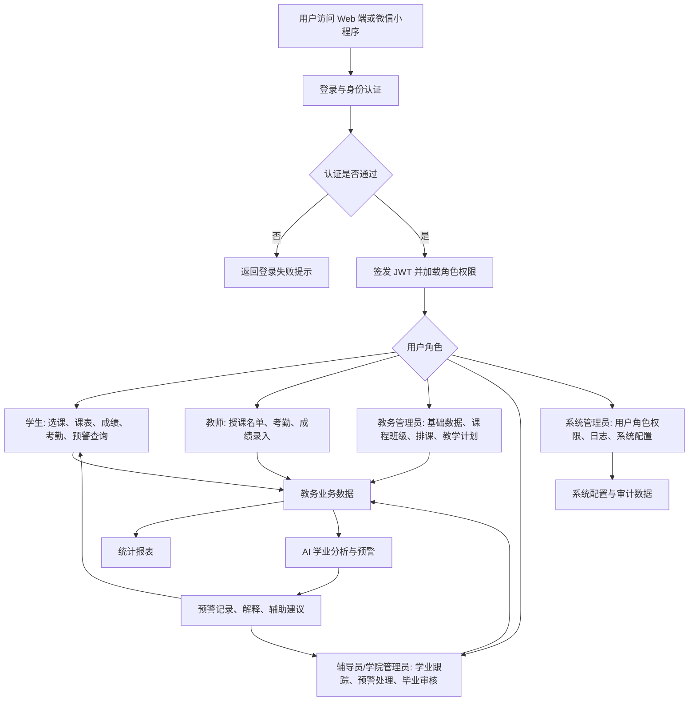
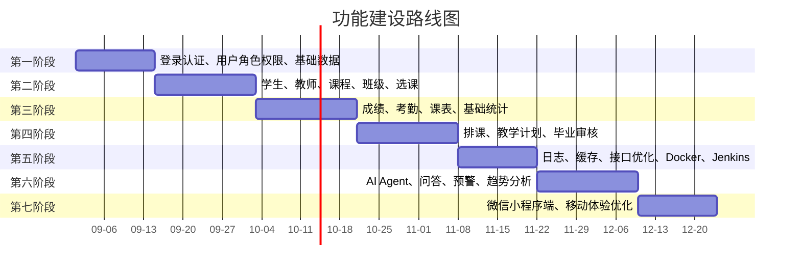
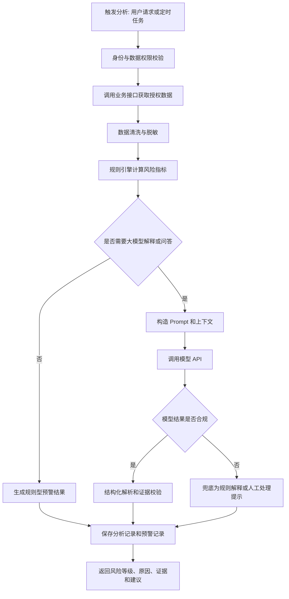
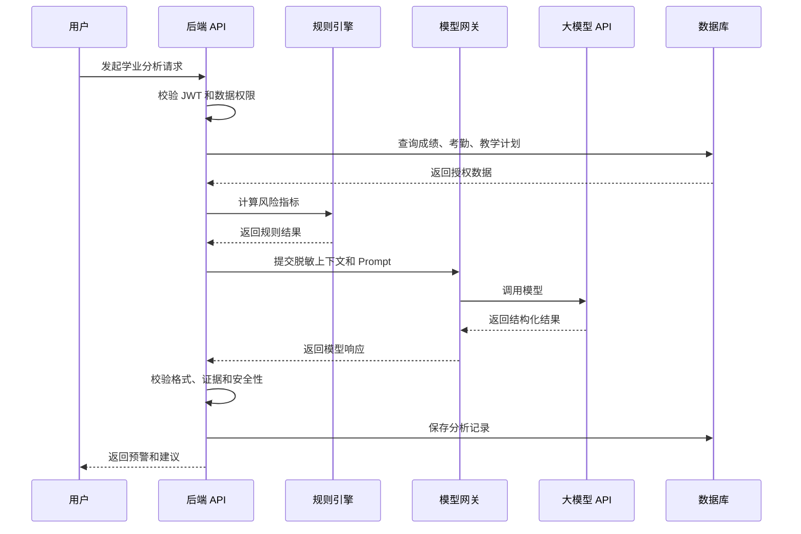
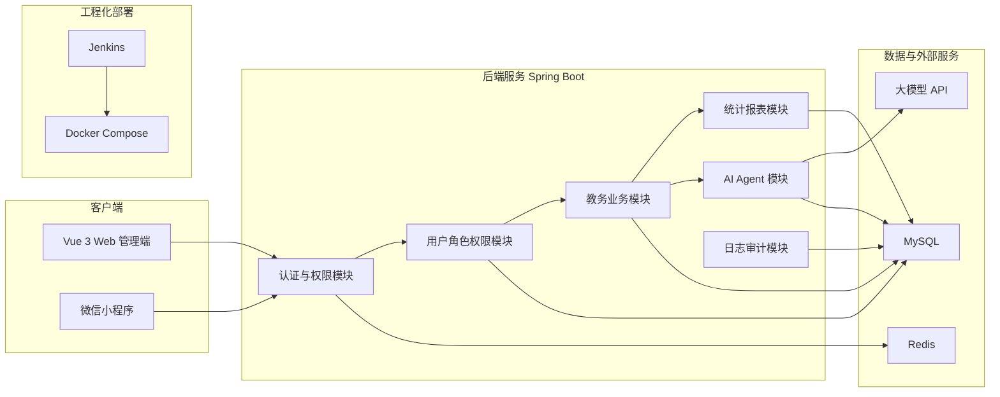

# 《需求规格说明书》

| 文档属性 | 内容 |
|---|---|
| 文档定位 | 项目尚未开始前制定的需求与总体规划 |
| 项目暂定名称 | 校园教务管理系统 |
| 正文称呼 | 本系统、教务系统 |
| 适用对象 | 项目组、指导教师、测试人员、运维人员、答辩与面试讲解场景 |
| 状态说明 | 本文档描述规划需求、建设目标、设计方向和验收标准，不代表功能已经完成 |

## 1. 项目背景与目标

### 1.1 建设背景

高校教务管理涉及学生、教师、课程、班级、选课、成绩、考勤、排课、教学计划、毕业审核等多类业务。传统人工管理或多个分散系统并存时，数据通常分散在 Excel、纸质表单、群消息、独立业务系统和人工台账中，容易出现数据重复录入、状态不同步、查询效率低、统计口径不一致、审批留痕不足等问题。

本系统计划围绕教务管理核心流程建设统一平台，使教务数据能够在统一身份认证、统一权限控制和统一数据模型下流转，并为后续 AI 学业分析、微信小程序访问、自动化部署和持续迭代提供基础。

### 1.2 现有问题

| 问题类别 | 典型表现 | 影响 |
|---|---|---|
| 数据分散 | 学生、课程、成绩、考勤等数据由不同人员分别维护 | 数据不一致，查询和核对成本高 |
| 人工处理多 | 选课名单、成绩统计、毕业审核依赖手工汇总 | 容易出错，处理周期长 |
| 权限边界模糊 | 不同角色使用同一份表格或账号 | 数据泄露风险高，责任难追溯 |
| 统计滞后 | 教务数据需要人工导出后再汇总 | 无法及时发现学业风险 |
| 流程不可追踪 | 修改成绩、调整课程、变更状态缺少日志 | 后续审计和问题定位困难 |
| 移动端体验不足 | 学生查询课表、成绩、预警需依赖 Web 或人工通知 | 高频场景访问不便 |
| 智能分析缺失 | 挂科、成绩下降、缺勤异常等风险依赖人工判断 | 预警不及时，辅导依据不足 |

### 1.3 面向用户

本系统主要面向以下用户：

| 用户类型 | 使用重点 |
|---|---|
| 学生 | 查询个人信息、选课、课表、成绩、考勤、学业预警和智能问答 |
| 教师 | 查看授课班级、管理课程相关数据、录入成绩、维护考勤 |
| 教务管理员 | 维护基础数据、课程班级、选课规则、排课、教学计划和统计报表 |
| 辅导员或学院管理员 | 查看本学院或负责班级学生情况，跟进预警和毕业审核 |
| 系统管理员 | 管理用户、角色、权限、系统配置、日志审计和部署运维 |

### 1.4 希望解决的业务问题

1. 建立统一教务数据入口，减少重复录入和人工核对。
2. 建立基于角色的访问控制，保证不同用户只能访问授权数据。
3. 支持学生、教师、课程、班级、选课、成绩、考勤、课表等基础教务业务。
4. 支持教学计划、毕业审核、数据统计和报表，为教务决策提供依据。
5. 规划 AI Agent，用于成绩趋势分析、风险识别、预警解释和辅助建议。
6. 规划微信小程序端，满足学生高频移动访问需求。
7. 引入 Docker Compose 和 Jenkins，提升部署、交付和演示稳定性。

### 1.5 建设目标、业务价值和预期成果

| 目标 | 说明 | 预期成果 |
|---|---|---|
| 业务集中化 | 将核心教务业务纳入统一平台 | 形成统一教务管理入口 |
| 数据规范化 | 统一学生、教师、课程、班级、成绩等数据模型 | 降低重复数据和口径差异 |
| 权限可控 | 按角色、组织、班级、课程控制数据访问 | 减少越权访问和误操作 |
| 流程可追踪 | 记录关键操作日志和状态变更 | 支持审计、追责和问题回溯 |
| 分析智能化 | 规划 AI Agent 辅助识别学业风险 | 提升预警及时性和解释能力 |
| 访问多端化 | Web 管理端与微信小程序端共用后端能力 | 提升学生查询和提醒体验 |
| 交付工程化 | 规划 Docker 和 Jenkins 自动化流程 | 提升部署一致性和迭代效率 |

### 1.6 项目范围

#### 1.6.1 本期规划范围

1. Web 管理端：面向管理员、教师、辅导员的教务管理界面。
2. 学生端能力：学生个人信息、选课、课表、成绩、考勤、预警查询。
3. 后端 API：统一认证、权限控制、业务接口、日志审计。
4. 数据库：核心教务实体及关系建模。
5. AI Agent：规划成绩趋势、学业风险、预警解释、问答和辅助建议。
6. 微信小程序：规划学生高频查询和通知能力。
7. 工程化：规划 Docker Compose、Jenkins、接口规范和测试验收。

#### 1.6.2 暂不建设内容

| 暂不建设内容 | 原因 |
|---|---|
| 财务缴费、宿舍管理、图书借阅 | 超出教务核心范围 |
| 人事系统、科研系统、资产系统 | 属于其他管理域 |
| 与学校统一身份认证平台的深度集成 | 可作为后续扩展，初期先预留接口 |
| 完整移动端管理后台 | 小程序初期仅面向学生高频场景 |
| 全自动智能排课优化算法 | 初期以规则约束和人工调整为主 |
| 模型自动替代人工审批 | AI 结果只作为辅助建议，不直接决定学籍或毕业结论 |

## 2. 用户角色与使用场景

| 角色 | 使用目标 | 主要操作 | 数据权限 | 典型业务场景 | 可能遇到的问题 |
|---|---|---|---|---|---|
| 学生 | 快速了解个人教务信息并完成选课 | 登录、查看个人信息、选课退课、查看课表、成绩、考勤、预警、发起问答 | 仅本人数据；可查看公开课程和本人选课记录 | 学期初选课；考试后查成绩；收到学业预警后查看原因 | 忘记密码、选课名额已满、成绩未发布、移动网络异常 |
| 教师 | 管理授课过程数据 | 查看授课班级、录入或修改成绩、登记考勤、查看课程名单 | 本人授课课程、课程学生名单、课程成绩和考勤 | 期末批量录入成绩；课堂点名后录入考勤 | 成绩格式错误、提交截止时间已过、课程权限不匹配 |
| 教务管理员 | 维护全校教务基础数据和流程 | 维护学生、教师、课程、班级、选课规则、排课、教学计划、报表 | 按职责范围访问全校或指定学院教务数据 | 新学期初始化课程和班级；发布选课；生成统计报表 | 数据导入失败、课程时间冲突、权限配置不完整 |
| 辅导员或学院管理员 | 跟踪学院或班级学生学习状态 | 查看学生信息、成绩、考勤、预警和毕业审核进度 | 所属学院、专业、年级或班级范围内数据 | 跟进挂科学生；查看缺勤异常；毕业资格初审 | 预警原因不清晰、数据同步延迟、学生转专业导致范围变化 |
| 系统管理员 | 保障系统账户、权限、配置和运行安全 | 用户管理、角色授权、菜单权限、日志查看、系统配置 | 系统级管理权限；不默认参与业务审批 | 创建账号；配置角色；排查异常访问 | 权限配置错误、日志量过大、服务部署异常 |

## 3. 总体业务流程

### 3.1 总体流程说明

1. 用户通过 Web 端或微信小程序端提交登录信息。
2. 后端完成身份认证，签发 JWT，并在后续请求中进行访问控制。
3. 不同角色进入对应业务模块，按权限访问学生、教师、课程、选课、成绩、考勤、课表等数据。
4. 教务管理员维护基础数据，形成课程、班级、教学计划和排课基础。
5. 学生在选课开放期完成选课，教师依据授课关系录入考勤和成绩。
6. 系统对成绩、考勤、挂科情况等进行统计，形成报表和预警数据。
7. AI Agent 在授权范围内调用业务接口，结合规则引擎和大模型生成分析结论、预警解释和辅助建议。
8. 学生可在 Web 端或小程序端查询个人课表、成绩、考勤、预警详情和问答结果。

### 3.2 业务流程图



### 3.3 主要业务流程

| 流程 | 触发角色 | 核心步骤 | 输出 |
|---|---|---|---|
| 用户登录与身份认证 | 全部角色 | 输入账号密码；后端校验；签发 JWT；加载角色菜单和权限 | 登录状态、Token、用户信息、权限集合 |
| 学生信息维护 | 教务管理员、辅导员 | 新增或导入学生；维护班级、专业、学籍状态；校验唯一性 | 学生档案 |
| 课程与班级管理 | 教务管理员 | 维护课程、班级、授课教师、容量和开课状态 | 课程库、班级数据 |
| 学生选课 | 学生、教务管理员 | 查询可选课程；校验名额、时间冲突、先修条件；生成选课记录 | 选课结果 |
| 教师录入成绩 | 教师 | 选择课程；录入成绩；系统校验分值和状态；提交发布 | 成绩记录 |
| 学生查看成绩 | 学生 | 查询本人已发布成绩；查看绩点、是否通过 | 成绩列表 |
| 考勤记录与统计 | 教师、辅导员 | 登记出勤、迟到、请假、缺勤；系统汇总统计 | 考勤记录、统计结果 |
| 课表查询 | 学生、教师 | 按学期、周次、角色查询课程时间地点 | 个人课表 |
| 教务排课 | 教务管理员 | 设置教学任务；校验教师、教室、时间冲突；生成课表 | 排课结果 |
| 教学计划管理 | 教务管理员 | 维护专业培养方案、课程要求、学分要求 | 教学计划 |
| 毕业审核 | 教务管理员、辅导员 | 汇总学分、必修课、成绩、学籍状态；生成审核结果 | 毕业资格结论 |
| 数据统计与报表 | 管理类角色 | 按学院、专业、课程、学期统计成绩、考勤、选课 | 统计报表 |
| AI 学业分析与预警 | 学生、辅导员、管理员 | 获取授权数据；规则初筛；模型解释；结构化输出 | 预警记录、建议 |
| 微信小程序访问 | 学生 | 登录绑定；查询课表、成绩、考勤、预警、消息 | 移动端查询结果 |

## 4. 系统功能需求

### 4.1 功能需求总览

| 模块 | 功能目标 | 使用角色 | 前置条件 | 主要输出 |
|---|---|---|---|---|
| 用户、角色与权限管理 | 管理账号、角色、菜单和数据权限 | 系统管理员 | 系统初始化完成 | 用户、角色、权限配置 |
| 登录、JWT 认证和访问控制 | 实现统一登录和接口访问控制 | 全部角色 | 用户账号有效 | Token、用户信息、权限集合 |
| 学生管理 | 维护学生基础档案和学籍状态 | 教务管理员、辅导员 | 角色具备学生管理权限 | 学生档案 |
| 教师管理 | 维护教师信息和授课关系 | 教务管理员 | 教师账号或档案存在 | 教师档案 |
| 课程与班级管理 | 管理课程、班级、容量、开课状态 | 教务管理员 | 基础字典和教师数据已维护 | 课程和班级信息 |
| 选课管理 | 支持学生选课、退课和名单管理 | 学生、教务管理员 | 开放选课且课程可选 | 选课记录 |
| 成绩管理 | 支持成绩录入、发布和查询 | 教师、学生、管理员 | 课程已结束或允许录入 | 成绩记录 |
| 考勤管理 | 支持考勤登记、查询和统计 | 教师、学生、辅导员 | 存在课程和学生名单 | 考勤记录 |
| 课表与排课管理 | 支持课表查询和教务排课 | 学生、教师、教务管理员 | 教学任务和教室资源已维护 | 课表数据 |
| 教学计划管理 | 管理培养方案和课程学分要求 | 教务管理员 | 专业、年级、课程数据存在 | 教学计划 |
| 毕业审核 | 判断学生是否满足毕业条件 | 教务管理员、辅导员 | 教学计划、成绩、学分数据完整 | 审核结论 |
| 数据统计与报表 | 输出教务统计结果 | 管理类角色 | 业务数据可查询 | 统计图表、导出数据 |
| 操作日志和系统管理 | 记录关键操作，管理系统参数 | 系统管理员 | 日志策略已配置 | 审计日志、配置项 |
| AI 学业预警与分析 Agent | 识别学业风险并生成解释建议 | 学生、辅导员、管理员 | 数据授权、模型配置可用 | 分析结果、预警记录 |
| 微信小程序端 | 提供学生移动端高频查询 | 学生 | 小程序已发布，账号可绑定 | 移动端页面数据 |

### 4.2 用户、角色与权限管理

| 项目 | 需求说明 |
|---|---|
| 功能目标 | 管理系统账号、角色、菜单权限、接口权限和数据访问范围 |
| 使用角色 | 系统管理员 |
| 前置条件 | 系统完成初始化，管理员账号可用 |
| 业务流程 | 创建用户；分配角色；配置菜单和接口权限；配置数据范围；保存后生效 |
| 输入数据 | 用户账号、姓名、角色、所属组织、启用状态、权限集合 |
| 输出结果 | 用户列表、角色列表、权限配置结果 |
| 异常情况 | 账号重复、角色不存在、权限配置为空、禁用账号登录 |
| 权限要求 | 仅系统管理员可维护；普通用户只能查看本人基础信息 |
| 验收标准 | 可新增、编辑、禁用用户；角色权限调整后重新登录生效；越权访问被拒绝并记录日志 |

### 4.3 登录、JWT 认证和访问控制

| 项目 | 需求说明 |
|---|---|
| 功能目标 | 提供统一登录、Token 签发、Token 校验、接口权限控制和自动登出机制 |
| 使用角色 | 全部角色 |
| 前置条件 | 用户账号存在且状态正常 |
| 业务流程 | 用户提交账号密码；系统校验身份；生成 JWT；前端保存登录状态；后续请求携带 Bearer Token；后端校验权限 |
| 输入数据 | 账号、密码、客户端类型、验证码或设备信息（可选） |
| 输出结果 | JWT、用户基础信息、角色、权限、过期时间 |
| 异常情况 | 密码错误、账号禁用、Token 过期、Token 篡改、权限不足 |
| 权限要求 | 登录接口开放；业务接口需认证；高权限接口需角色授权 |
| 验收标准 | 未登录不能访问受保护接口；Token 过期返回统一错误；权限不足返回明确提示 |

### 4.4 学生管理

| 项目 | 需求说明 |
|---|---|
| 功能目标 | 维护学生档案、班级归属、专业年级、学籍状态和联系方式 |
| 使用角色 | 教务管理员、辅导员或学院管理员 |
| 前置条件 | 学院、专业、班级等基础数据已维护 |
| 业务流程 | 新增或导入学生；校验学号唯一性；维护学籍状态；支持查询、筛选、导出 |
| 输入数据 | 学号、姓名、性别、学院、专业、年级、班级、联系方式、学籍状态 |
| 输出结果 | 学生档案、查询列表、导入结果 |
| 异常情况 | 学号重复、班级不存在、必填字段缺失、状态变更不合法 |
| 权限要求 | 管理员可维护授权范围内学生；辅导员只能查看或维护负责范围 |
| 验收标准 | 学生信息可按学院、专业、班级筛选；非法数据不能保存；状态变更有日志 |

### 4.5 教师管理

| 项目 | 需求说明 |
|---|---|
| 功能目标 | 维护教师基础信息、所属学院和授课关系 |
| 使用角色 | 教务管理员、系统管理员 |
| 前置条件 | 学院或组织数据存在 |
| 业务流程 | 创建教师档案；关联登录账号；维护职称、学院、联系方式；关联授课课程 |
| 输入数据 | 工号、姓名、学院、职称、联系方式、启用状态 |
| 输出结果 | 教师档案、教师列表、授课关系 |
| 异常情况 | 工号重复、教师被停用后仍存在授课任务、联系方式格式错误 |
| 权限要求 | 教务管理员维护教师业务信息；系统管理员维护账号和角色 |
| 验收标准 | 教师可绑定课程；停用教师不能登录；教师只能访问本人授课数据 |

### 4.6 课程与班级管理

| 项目 | 需求说明 |
|---|---|
| 功能目标 | 管理课程库、教学班、行政班、课程容量、学分和开课状态 |
| 使用角色 | 教务管理员 |
| 前置条件 | 教师、学院、专业、学期数据已维护 |
| 业务流程 | 创建课程；设置学分、课时和课程类型；创建教学班；关联教师、容量、时间和地点 |
| 输入数据 | 课程编号、课程名称、学分、课程类型、容量、授课教师、学期 |
| 输出结果 | 课程列表、班级列表、可选课程 |
| 异常情况 | 课程编号重复、容量小于已选人数、教师不存在、课程状态不允许修改 |
| 权限要求 | 仅授权教务管理员可维护；学生只能查看开放课程 |
| 验收标准 | 课程可按学期和学院查询；容量规则有效；禁用课程不可被选择 |

### 4.7 选课管理

| 项目 | 需求说明 |
|---|---|
| 功能目标 | 支持学生自主选课、退课、选课名单管理和选课约束校验 |
| 使用角色 | 学生、教务管理员 |
| 前置条件 | 课程处于开放选课状态；学生账号有效 |
| 业务流程 | 学生查询可选课程；提交选课；系统校验容量、冲突和资格；生成选课记录；允许在规定时间内退课 |
| 输入数据 | 学生 ID、课程 ID、教学班 ID、学期 |
| 输出结果 | 选课成功或失败结果、选课记录、课程名单 |
| 异常情况 | 课程已满、时间冲突、重复选课、选课时间未开放、学生状态异常 |
| 权限要求 | 学生只能操作本人选课；管理员可管理授权范围内选课记录 |
| 验收标准 | 满额课程不可继续选择；重复选课被拦截；退课后容量恢复 |

### 4.8 成绩管理

| 项目 | 需求说明 |
|---|---|
| 功能目标 | 支持教师录入成绩、管理员审核或发布、学生查询已发布成绩 |
| 使用角色 | 教师、学生、教务管理员、辅导员 |
| 前置条件 | 学生已选课或在课程名单中；成绩录入窗口开放 |
| 业务流程 | 教师选择课程；录入平时成绩、考试成绩或总评成绩；系统校验分值；保存草稿或提交；管理员发布；学生查询 |
| 输入数据 | 学生 ID、课程 ID、成绩项、总评成绩、成绩状态、备注 |
| 输出结果 | 成绩记录、绩点、是否通过、成绩统计 |
| 异常情况 | 分值超范围、学生不在名单中、成绩已发布后无权限修改、重复提交 |
| 权限要求 | 教师只能录入本人授课课程成绩；学生只能查看本人已发布成绩 |
| 验收标准 | 成绩范围校验有效；未发布成绩学生不可见；修改已发布成绩需记录日志 |

### 4.9 考勤管理

| 项目 | 需求说明 |
|---|---|
| 功能目标 | 登记学生出勤状态，支持按课程、学生、班级和时间统计 |
| 使用角色 | 教师、学生、辅导员、教务管理员 |
| 前置条件 | 课程课表已存在；学生在课程名单中 |
| 业务流程 | 教师选择课程和上课日期；登记出勤、迟到、请假、缺勤；系统保存；学生和辅导员查询统计 |
| 输入数据 | 课程 ID、学生 ID、上课日期、节次、考勤状态、备注 |
| 输出结果 | 考勤记录、缺勤次数、出勤率、异常名单 |
| 异常情况 | 重复点名、课程不存在、学生不属于该课程、状态值非法 |
| 权限要求 | 教师维护本人课程考勤；学生查看本人考勤；辅导员查看负责范围 |
| 验收标准 | 考勤状态保存准确；统计结果与明细一致；异常缺勤可触发预警 |

### 4.10 课表与排课管理

| 项目 | 需求说明 |
|---|---|
| 功能目标 | 支持学生和教师查询课表，支持教务管理员排课和冲突检测 |
| 使用角色 | 学生、教师、教务管理员 |
| 前置条件 | 学期、课程、教师、教室和教学班数据存在 |
| 业务流程 | 管理员创建教学任务；设置时间、地点、周次；系统校验冲突；生成课表；用户按周查询 |
| 输入数据 | 课程 ID、教师 ID、班级 ID、教室、周次、星期、节次 |
| 输出结果 | 学生课表、教师课表、班级课表、冲突提示 |
| 异常情况 | 教师时间冲突、教室冲突、班级冲突、周次格式错误 |
| 权限要求 | 管理员可排课；学生和教师只能查询相关课表 |
| 验收标准 | 同一教师、教室、班级同一时间不能重复排课；课表按周展示准确 |

### 4.11 教学计划管理

| 项目 | 需求说明 |
|---|---|
| 功能目标 | 管理专业培养方案、课程类别、学分要求和毕业条件 |
| 使用角色 | 教务管理员、学院管理员 |
| 前置条件 | 专业、年级、课程数据完整 |
| 业务流程 | 创建教学计划；配置必修、选修和实践课程；设置学分要求；发布计划；供选课和毕业审核引用 |
| 输入数据 | 专业、年级、课程清单、课程类别、最低学分、计划状态 |
| 输出结果 | 教学计划、课程要求、学分规则 |
| 异常情况 | 课程不存在、学分规则冲突、已发布计划被随意修改 |
| 权限要求 | 教务管理员维护；学院管理员可维护本学院计划 |
| 验收标准 | 教学计划可被毕业审核引用；已发布计划修改需留痕 |

### 4.12 毕业审核

| 项目 | 需求说明 |
|---|---|
| 功能目标 | 根据教学计划、成绩、学分和学籍状态判断学生毕业资格 |
| 使用角色 | 教务管理员、辅导员或学院管理员 |
| 前置条件 | 教学计划已发布；成绩和学分数据完整 |
| 业务流程 | 选择学生或批次；系统汇总课程完成情况；校验必修课、选修学分、挂科、学籍状态；生成审核结论 |
| 输入数据 | 学生 ID、专业年级、教学计划 ID、审核批次 |
| 输出结果 | 通过、不通过、待人工复核、缺失项说明 |
| 异常情况 | 教学计划缺失、成绩未发布、课程替代关系不明确 |
| 权限要求 | 管理员可发起审核；辅导员查看负责学生审核情况 |
| 验收标准 | 审核结论包含原因；不通过项可追溯到课程或学分要求 |

### 4.13 数据统计与报表

| 项目 | 需求说明 |
|---|---|
| 功能目标 | 对学生、课程、选课、成绩、考勤、预警等数据进行统计和报表输出 |
| 使用角色 | 教务管理员、辅导员、学院管理员、系统管理员 |
| 前置条件 | 业务数据已产生且用户具备统计权限 |
| 业务流程 | 用户选择统计维度和时间范围；系统聚合数据；展示图表和表格；支持导出 |
| 输入数据 | 学期、学院、专业、班级、课程、统计类型 |
| 输出结果 | 统计表、趋势图、异常名单、导出文件 |
| 异常情况 | 查询范围过大、数据为空、无导出权限 |
| 权限要求 | 按角色和数据范围展示统计结果 |
| 验收标准 | 统计结果与明细数据一致；无权限用户不能查看跨范围数据 |

### 4.14 操作日志和系统管理

| 项目 | 需求说明 |
|---|---|
| 功能目标 | 记录关键操作，支持审计、异常定位和系统配置管理 |
| 使用角色 | 系统管理员 |
| 前置条件 | 日志记录策略已启用 |
| 业务流程 | 系统自动记录登录、增删改、导入导出、权限变更、AI 调用等操作；管理员查询日志 |
| 输入数据 | 操作人、接口路径、请求方法、业务模块、操作结果、时间范围 |
| 输出结果 | 操作日志、异常日志、系统参数 |
| 异常情况 | 日志写入失败、日志量过大、敏感字段未脱敏 |
| 权限要求 | 仅系统管理员或审计角色可查看日志 |
| 验收标准 | 关键操作有日志；密码、Token、Cookie 等敏感信息不得记录明文 |

### 4.15 AI 学业预警与分析 Agent

| 项目 | 需求说明 |
|---|---|
| 功能目标 | 基于成绩、考勤、选课、挂科和教学计划等数据识别学业风险，生成解释和辅助建议 |
| 使用角色 | 学生、辅导员、学院管理员、教务管理员 |
| 前置条件 | 学生授权数据可查询；规则引擎和模型服务配置可用 |
| 业务流程 | 用户发起分析或系统定时触发；规则引擎初筛；Agent 获取必要上下文；调用业务工具和模型；生成结构化结果；保存预警记录 |
| 输入数据 | 学生基础信息、课程成绩、考勤、选课、学分要求、历史预警、用户问题 |
| 输出结果 | 风险等级、风险原因、证据数据、解释文本、建议措施、置信度 |
| 异常情况 | 数据不足、模型超时、模型返回格式错误、用户越权查询 |
| 权限要求 | Agent 只能访问当前用户授权范围内的数据；学生只能分析本人数据 |
| 验收标准 | 输出结果可追溯到真实业务数据；模型失败时返回规则结果或人工处理提示 |

### 4.16 微信小程序端

| 项目 | 需求说明 |
|---|---|
| 功能目标 | 面向学生提供移动端高频查询、预警提醒和智能问答 |
| 使用角色 | 学生 |
| 前置条件 | 学生账号可登录或完成微信身份绑定 |
| 业务流程 | 学生登录或绑定；进入首页；查询课表、成绩、考勤、预警；接收消息；发起学业问答 |
| 输入数据 | 登录凭证、学生 ID、查询学期、周次、问题内容 |
| 输出结果 | 课表、成绩、考勤、预警详情、问答结果 |
| 异常情况 | 网络异常、登录过期、绑定失败、接口无权限、模型暂不可用 |
| 权限要求 | 仅访问本人数据；不提供复杂管理功能 |
| 验收标准 | 高频查询路径短；移动端展示清晰；接口错误有明确提示 |

## 5. 教务功能建设顺序



| 阶段 | 阶段目标 | 主要功能 | 依赖关系 | 验收条件 |
|---|---|---|---|---|
| 第一阶段 | 建立系统访问入口和权限基础 | 登录认证、JWT、用户、角色、权限、基础字典 | 数据库、后端框架、前端路由 | 不同角色可登录并访问授权菜单；越权接口被拒绝 |
| 第二阶段 | 建立核心教务基础数据 | 学生、教师、课程、班级、选课 | 第一阶段权限体系 | 可完成学生和教师维护；课程开放后学生可选课 |
| 第三阶段 | 支持教学过程数据管理 | 成绩、考勤、课表查询、基础统计 | 第二阶段选课和课程名单 | 教师可录入成绩和考勤；学生可查询本人数据 |
| 第四阶段 | 完善教务计划和审核闭环 | 排课、教学计划、毕业审核 | 课程、成绩、课表、学分数据 | 可生成课表；可按教学计划输出毕业审核结果 |
| 第五阶段 | 提升系统可运维性 | 操作日志、Redis 缓存、接口优化、Docker Compose、Jenkins | 核心业务稳定 | 可一键启动环境；自动构建流程可执行；关键操作有日志 |
| 第六阶段 | 引入智能分析能力 | AI Agent、智能问答、学业预警、趋势分析 | 成绩、考勤、教学计划、日志 | 预警结果可解释；模型异常有兜底；数据访问受控 |
| 第七阶段 | 提升学生移动端体验 | 微信小程序登录、课表、成绩、考勤、预警、问答 | 后端 API 稳定、认证机制可复用 | 学生可通过小程序完成高频查询；异常提示清晰 |

## 6. AI Agent 设计

### 6.1 接入 Agent 的原因

教务管理中存在大量需要综合判断的场景，例如学生成绩持续下降、缺勤次数异常、挂科课程影响毕业、某类课程学分不足等。单纯报表只能展示结果，难以解释风险原因，也难以根据学生个体情况生成辅助建议。规划接入 AI Agent 的目的，是在规则引擎确保可控性的基础上，结合大模型的解释和问答能力，为学生、辅导员和教务人员提供可追溯、可校验、可审计的学业分析。

Agent 不直接替代教务人员决策，不直接修改业务数据，不直接给出毕业资格最终审批；其定位是辅助分析、风险提示、解释说明和建议生成。

### 6.2 Agent 能力规划

| 能力 | 说明 | 初期版本 | 后续扩展 |
|---|---|---|---|
| 成绩趋势分析 | 分析学生多学期成绩、绩点和课程通过情况 | 支持按学期趋势和挂科统计 | 支持同专业横向对比和预测 |
| 学业风险识别 | 根据挂科、低绩点、缺勤、学分不足识别风险 | 基于规则输出风险等级 | 结合模型生成综合风险解释 |
| 学业预警记录 | 保存预警等级、原因、证据和处理状态 | 支持生成和查询 | 支持预警闭环跟进 |
| 预警详情解释 | 将规则结果转化为可理解说明 | 输出结构化解释 | 支持多轮追问 |
| 学业智能问答 | 回答学生关于成绩、课表、学分、风险的问题 | 基于授权数据回答 | 支持政策文档检索增强 |
| 辅助建议生成 | 根据课程、成绩、挂科情况生成建议 | 给出学习和补修建议 | 支持个性化计划推荐 |

### 6.3 Agent 输入数据

| 数据类型 | 字段示例 | 来源 | 使用目的 |
|---|---|---|---|
| 学生基础信息 | 学号、年级、专业、班级、学籍状态 | 学生管理模块 | 判断适用规则和数据范围 |
| 成绩数据 | 课程、学分、成绩、绩点、是否通过、学期 | 成绩管理模块 | 分析趋势、挂科和学分完成情况 |
| 选课数据 | 已选课程、退课记录、当前学期课程 | 选课管理模块 | 判断当前学习负载 |
| 考勤数据 | 缺勤、迟到、请假次数、出勤率 | 考勤管理模块 | 识别过程性风险 |
| 教学计划 | 必修课、选修课、最低学分、毕业条件 | 教学计划模块 | 判断学分和课程要求 |
| 历史预警 | 风险等级、原因、处理结果 | 预警记录模块 | 避免重复预警，观察变化 |
| 用户问题 | 自然语言问题、上下文范围 | Web 或小程序 | 生成问答结果 |

### 6.4 Agent 处理流程



### 6.5 规则引擎与大模型职责划分

| 职责 | 规则引擎 | 大模型 |
|---|---|---|
| 风险等级判定 | 负责，依据明确阈值计算 | 不直接决定最终等级 |
| 数据计算 | 负责均分、绩点、缺勤率、学分缺口等 | 不进行不可校验的关键计算 |
| 证据引用 | 负责提供真实课程、成绩和考勤数据 | 只能引用上下文中给出的证据 |
| 原因解释 | 输出基础原因 | 转换为自然语言解释 |
| 辅助建议 | 根据规则生成基础建议 | 结合上下文生成更清晰的建议 |
| 问答 | 提供可查询数据 | 组织回答，但不得越权或编造 |
| 审批决策 | 不自动审批 | 不参与最终审批 |

### 6.6 Agent 可调用的业务工具或接口

| 工具或接口 | 调用目的 | 权限限制 |
|---|---|---|
| 学生信息查询 | 获取学生专业、年级、班级、学籍状态 | 学生仅本人；辅导员仅负责范围 |
| 成绩查询 | 获取课程成绩、绩点、挂科情况 | 仅授权成绩范围 |
| 考勤统计查询 | 获取缺勤、迟到、请假和出勤率 | 仅授权课程或学生范围 |
| 选课记录查询 | 获取当前课程和历史修读情况 | 仅授权范围 |
| 教学计划查询 | 获取毕业要求和课程类别 | 按专业年级授权 |
| 预警记录查询 | 查询历史预警和处理状态 | 按学生范围授权 |
| 预警记录写入 | 保存本次分析结果 | 仅系统服务账号或授权角色 |
| 操作日志写入 | 记录 Agent 请求和结果 | 系统自动写入 |

### 6.7 Prompt 设计方向

Prompt 计划采用结构化模板，明确角色、任务、输入数据、限制条件和输出格式。

| 组成部分 | 设计要求 |
|---|---|
| 系统约束 | 说明模型是教务分析助手，只能基于提供数据回答 |
| 数据边界 | 明确不得推测未提供的成绩、政策、身份和审批结论 |
| 分析任务 | 指定分析成绩趋势、风险原因、证据和建议 |
| 安全要求 | 不输出隐私字段，不暴露内部 Token、接口凭证或无关学生信息 |
| 输出格式 | 要求返回 JSON 结构，包含风险等级、原因、证据、建议和置信度 |
| 失败处理 | 数据不足时说明缺失数据，不编造结论 |

### 6.8 上下文组织方式

1. 按学生维度组织基础信息、成绩、考勤、选课和教学计划摘要。
2. 优先传入聚合后的关键指标，减少不必要的明细。
3. 对个人身份信息进行最小化处理，例如使用学生编号或脱敏姓名。
4. 对多轮问答保留最近问题、已引用证据和当前分析范围。
5. 对超长上下文进行摘要，只保留与问题相关的课程、学期和风险项。

### 6.9 输出结果结构

```json
{
  "riskLevel": "LOW | MEDIUM | HIGH",
  "riskType": ["GRADE_DROP", "FAILED_COURSE", "ATTENDANCE_ABNORMAL", "CREDIT_GAP"],
  "summary": "风险摘要",
  "evidence": [
    {
      "type": "GRADE",
      "courseName": "课程名称",
      "term": "学期",
      "value": "成绩或指标",
      "reason": "证据说明"
    }
  ],
  "suggestions": [
    "建议内容"
  ],
  "confidence": 0.85,
  "needManualReview": false
}
```

### 6.10 结果校验

| 校验项 | 要求 |
|---|---|
| 格式校验 | 模型输出必须能解析为预期 JSON 结构 |
| 枚举校验 | 风险等级、风险类型必须属于系统枚举 |
| 证据校验 | 输出中的课程、成绩、考勤必须来自输入上下文 |
| 权限校验 | 不允许出现用户无权访问的学生或课程信息 |
| 结论校验 | 风险等级以规则引擎结果为准，模型不得擅自升级或降级 |
| 敏感信息校验 | 不输出密码、Token、Cookie、密钥、完整身份证等敏感数据 |

### 6.11 异常兜底

| 异常场景 | 兜底策略 |
|---|---|
| 模型幻觉 | 丢弃无法被业务数据验证的内容，仅保留规则结果 |
| 模型超时 | 返回规则引擎分析结果，并提示智能解释暂不可用 |
| 模型调用失败 | 记录失败日志，进入重试或降级流程 |
| 输出格式错误 | 尝试一次格式修复；仍失败则返回固定模板 |
| 数据不足 | 明确提示缺少成绩、考勤或教学计划数据 |
| 越权请求 | 拒绝调用 Agent，并记录安全日志 |

### 6.12 数据访问权限限制

1. Agent 调用业务接口前必须使用当前用户身份或服务端授权上下文。
2. 学生用户只能分析本人数据。
3. 教师只能分析与本人授课课程相关的学生数据，且需符合学校规则。
4. 辅导员或学院管理员只能访问负责学院、专业、年级或班级范围。
5. 系统管理员不默认拥有业务数据分析权限，除非被明确授予审计或运维权限。
6. Agent 请求日志中不得记录明文密码、Token、Cookie 和模型密钥。

### 6.13 请求、响应和分析结果记录

| 记录对象 | 记录内容 |
|---|---|
| Agent 请求记录 | 请求用户、角色、分析对象、调用时间、请求类型、脱敏上下文摘要 |
| 模型调用记录 | 模型名称、请求耗时、Token 用量、调用状态、错误码 |
| 分析结果记录 | 风险等级、风险类型、证据摘要、建议摘要、是否需要人工复核 |
| 预警记录 | 学生、预警等级、预警原因、处理状态、处理人、更新时间 |
| 审计日志 | 接口路径、请求方法、操作人、操作结果、客户端类型 |

### 6.14 初期版本与后续扩展

| 范围 | 功能 |
|---|---|
| 初期版本 | 成绩趋势分析、挂科识别、缺勤异常识别、学分缺口提示、预警解释、基础学业问答 |
| 后续扩展 | 多轮学习规划、课程推荐、政策文档检索增强、同专业横向对比、个性化学习计划、辅导员跟进闭环 |

## 7. 大模型接入方案

### 7.1 用途区分

| 用途类型 | 说明 | 状态表述 |
|---|---|---|
| 开发辅助用途 | Codex、DeepSeek、GLM 等模型可用于代码生成、测试用例设计、接口调试、文档整理和问题分析 | 可选方案，不属于系统运行时能力 |
| 系统运行时用途 | 用于学业分析、智能问答、预警解释和辅助建议 | 规划接入，需完成安全、权限、日志和成本控制后启用 |

### 7.2 候选模型及选择原因

| 候选模型 | 适用方向 | 选择原因 | 状态 |
|---|---|---|---|
| OpenAI GPT 系列 | 高质量推理、结构化输出、复杂问答 | 适合解释型分析和可靠 JSON 输出 | 规划候选 |
| DeepSeek 系列 | 中文理解、成本控制、代码和推理辅助 | 适合开发辅助和部分运行时分析 | 可选方案 |
| GLM 系列 | 中文场景、本地生态适配 | 可作为国产模型备选 | 可选方案 |
| 本地开源模型 | 私有化部署、敏感数据不出域 | 适合后续隐私要求较高场景 | 后续扩展 |

### 7.3 模型 API 调用流程

1. 业务模块发起分析请求。
2. 后端校验用户身份、角色和数据范围。
3. 后端查询必要教务数据并进行脱敏和摘要。
4. 规则引擎计算基础指标和风险等级。
5. Prompt 构造器组织模型输入。
6. 模型网关根据配置选择模型供应商。
7. 调用模型 API，设置超时时间、最大 Token 和重试策略。
8. 解析模型输出，进行结构校验、证据校验和安全校验。
9. 保存调用记录、分析记录和预警记录。
10. 返回统一接口响应。



### 7.4 超时、重试、限流和成本控制

| 项目 | 规划要求 |
|---|---|
| 请求超时 | 单次模型调用设置明确超时时间，超时后降级为规则结果 |
| 重试策略 | 对网络错误或 5xx 错误可进行有限次数重试；业务校验失败不重试 |
| 限流策略 | 按用户、角色、接口和时间窗口限制调用频率 |
| 成本控制 | 限制上下文长度、最大输出 Token、批量分析频率和并发数 |
| 缓存策略 | 对相同学生、相同数据版本、相同分析类型可短期缓存结果 |
| 队列策略 | 批量预警分析可进入异步任务，避免阻塞在线请求 |

### 7.5 敏感信息、Token 和密钥管理

1. 模型 API Key 通过环境变量或安全配置中心管理，不写入代码仓库。
2. JWT Secret 必须满足强度要求，并按环境区分开发、测试和生产配置。
3. 发送给模型的数据应最小化，避免包含密码、Token、Cookie、身份证号等敏感字段。
4. 日志中仅记录脱敏摘要，不记录完整 Prompt 中的敏感信息。
5. 小程序端不得持有模型密钥，所有模型调用必须经后端代理。

### 7.6 多模型切换和本地模型

模型调用计划通过模型网关抽象，支持按配置切换供应商、模型名称、超时时间和最大 Token。初期可先接入单一云端模型，后续根据成本、隐私和稳定性要求接入本地模型。本地模型适合处理较敏感或高频的基础问答，但需要评估服务器资源、推理速度、效果稳定性和运维成本。

### 7.7 模型结果安全校验

1. 模型输出不得直接写入业务结论字段，需经过后端校验。
2. 涉及风险等级时，以规则引擎结果为准。
3. 涉及建议内容时，需过滤不当、歧视性、绝对化或越权表述。
4. 涉及数据引用时，必须能在输入证据中找到对应记录。
5. 涉及用户问答时，不回答与当前用户无关的学生信息。

## 8. 技术架构设计

### 8.1 技术方向

| 层次 | 技术规划 | 用途 |
|---|---|---|
| 后端 | Java、Spring Boot | 提供业务 API 和系统服务 |
| 安全 | Spring Security、JWT | 登录认证、接口鉴权、角色控制 |
| 数据访问 | MyBatis-Plus | 数据 CRUD、分页、条件查询 |
| 数据库 | MySQL | 持久化教务业务数据 |
| 缓存 | Redis | 缓存用户权限、热点字典、短期统计结果 |
| 前端 | Vue 3、Element Plus | Web 管理端和学生 Web 页面 |
| 移动端 | 微信小程序 | 学生高频查询和通知入口 |
| 部署 | Docker Compose | 编排前端、后端、MySQL、Redis 等服务 |
| 自动化 | Jenkins | 构建、测试、镜像打包和部署 |

### 8.2 系统架构图



### 8.3 前后端系统边界

| 边界 | 前端职责 | 后端职责 |
|---|---|---|
| 登录认证 | 收集登录信息、保存 Token、路由守卫 | 校验账号密码、签发 JWT、鉴权 |
| 权限控制 | 根据权限展示菜单和按钮 | 根据角色和数据范围拦截接口 |
| 数据校验 | 基础表单校验和友好提示 | 权威业务校验和异常返回 |
| 业务处理 | 页面交互、列表筛选、表单提交 | 事务处理、状态变更、规则判断 |
| 统计展示 | 图表和表格展示 | 数据聚合、分页、导出 |
| AI 问答 | 输入问题、展示结果 | 数据授权、模型调用、结果校验 |

### 8.4 模块划分

后端计划按业务域划分模块：认证授权、用户角色权限、学生、教师、课程班级、选课、成绩、考勤、课表排课、教学计划、毕业审核、统计报表、AI Agent、日志审计、系统配置。

前端计划按页面和业务模块划分：登录页、布局框架、用户权限、学生管理、教师管理、课程管理、班级管理、选课管理、成绩管理、考勤管理、课表排课、教学计划、毕业审核、统计报表、AI 预警、小程序接口适配说明。

### 8.5 数据流转

1. 前端通过 Axios 或小程序网络请求调用后端 API。
2. 请求头携带 `Authorization: Bearer <token>`。
3. Spring Security 解析 JWT，加载用户身份和权限。
4. Controller 接收请求并进行参数校验。
5. Service 执行业务规则、权限范围和事务处理。
6. MyBatis-Plus 访问 MySQL。
7. Redis 用于缓存登录状态辅助信息、权限、字典和热点统计。
8. 结果按统一响应结构返回前端。

### 8.6 认证和权限机制

| 机制 | 规划说明 |
|---|---|
| 登录认证 | 用户提交账号密码，后端校验后签发 JWT |
| Token 有效期 | 计划设置固定有效期，可结合刷新机制扩展 |
| 接口鉴权 | 使用 Spring Security 拦截受保护接口 |
| 角色权限 | 按学生、教师、教务管理员、辅导员、系统管理员区分 |
| 数据权限 | 按本人、授课课程、班级、学院、全校等范围控制 |
| 前端守卫 | 根据用户角色控制路由和按钮显示 |

### 8.7 缓存使用场景

| 场景 | 缓存内容 | 注意事项 |
|---|---|---|
| 用户权限 | 用户角色、菜单、按钮权限 | 权限变更后需失效 |
| 基础字典 | 学期、学院、专业、课程类型 | 数据变更后刷新 |
| 热点查询 | 课表、课程列表、统计摘要 | 设置合理过期时间 |
| AI 分析 | 相同数据版本的短期分析结果 | 不缓存敏感明文上下文 |
| 限流计数 | 模型调用次数、登录失败次数 | 防止暴力请求和成本失控 |

### 8.8 日志和异常处理

1. 统一异常处理，返回稳定的错误码和错误信息。
2. 记录登录、权限变更、成绩修改、导入导出、排课调整、毕业审核、AI 调用等关键操作。
3. 日志中不记录密码、Token、Cookie 和密钥。
4. 对业务异常、权限异常、参数异常、系统异常进行分类处理。
5. 对模型调用失败、第三方接口异常和小程序网络异常提供明确提示。

### 8.9 Docker 环境编排

Docker Compose 计划编排以下服务：

| 服务 | 作用 |
|---|---|
| backend | Spring Boot 后端服务 |
| frontend | Vue Web 前端构建产物或 Nginx 服务 |
| mysql | 教务业务数据库 |
| redis | 缓存、限流和短期状态 |
| nginx | 反向代理和静态资源服务，可选 |

环境变量包括数据库连接、Redis 密码、JWT Secret、模型 API Key、模型供应商配置等。生产环境应使用独立密钥管理方式，不在仓库中提交真实密钥。

### 8.10 Jenkins 自动化构建和部署

Jenkins 计划支持以下流水线：

1. 拉取代码。
2. 后端编译和单元测试。
3. 前端依赖安装和构建。
4. 构建 Docker 镜像。
5. 执行接口冒烟测试。
6. 推送镜像或部署到目标服务器。
7. 输出构建日志和失败原因。

### 8.11 微信小程序复用后端 API

微信小程序端计划复用后端认证、学生、课表、成绩、考勤、预警和问答接口。后端可通过客户端类型区分 Web 和小程序请求，但核心业务规则、权限校验和响应格式保持一致。小程序不直接访问数据库，不直接调用模型 API，不保存后端密钥。

## 9. 微信小程序设计

### 9.1 增加微信小程序的原因

学生查询课表、成绩、考勤、预警等属于高频、碎片化、移动化场景。相比 Web 管理端，小程序更适合快速打开、即时提醒和移动端展示。本系统计划增加微信小程序，是为了提高学生访问效率和预警触达率，而不是在小程序中重复建设复杂管理后台。

### 9.2 与 Web 管理端的区别

| 对比项 | Web 管理端 | 微信小程序端 |
|---|---|---|
| 主要用户 | 教务管理员、教师、辅导员、系统管理员 | 学生 |
| 功能重点 | 管理、维护、审批、统计、配置 | 查询、提醒、问答 |
| 操作复杂度 | 支持复杂表格、批量操作、导入导出 | 操作路径短，避免复杂表单 |
| 页面设计 | 信息密度较高，适合桌面端 | 卡片化、列表化、移动端适配 |
| 权限范围 | 按角色管理多类数据 | 仅本人数据 |

### 9.3 小程序功能规划

| 功能 | 设计说明 | 验收标准 |
|---|---|---|
| 学生登录 | 支持账号密码登录，后续可选微信绑定 | 登录成功后可获取 Token；登录失败提示明确 |
| 课表查询 | 按当前周、指定周、学期展示个人课表 | 展示课程、时间、地点、教师 |
| 成绩查询 | 查询已发布成绩和课程通过情况 | 未发布成绩不展示；异常状态有提示 |
| 考勤查看 | 展示本人课程考勤明细和统计 | 可看到缺勤、迟到、请假等状态 |
| 学业预警 | 展示预警等级、类型和状态 | 高风险预警有醒目提示 |
| 预警详情 | 展示风险原因、证据和建议 | 证据来自真实业务数据 |
| 消息通知 | 接收成绩发布、考勤异常、预警提醒 | 可查看消息列表和详情 |
| 学业问答 | 学生围绕本人学业数据提问 | 不回答他人数据；模型异常有兜底 |

### 9.4 设计理念

1. 面向学生高频场景，首页优先展示今日课表、最新成绩、考勤异常和预警提醒。
2. 操作路径短，常用信息原则上不超过两次点击可达。
3. 信息展示清晰，避免桌面端复杂表格直接搬到移动端。
4. 适配移动端屏幕，重点优化列表、详情页、加载态和空状态。
5. 网络异常、登录过期、无权限、数据为空时提供明确提示。
6. 与 Web 端共用后端接口、认证规则和统一响应格式。
7. 不在小程序中重复建设角色管理、排课、教学计划维护等复杂管理功能。

## 10. 数据库与接口规划

### 10.1 核心实体及关系

```mermaid
erDiagram
    USER ||--o{ USER_ROLE : has
    ROLE ||--o{ USER_ROLE : assigned
    ROLE ||--o{ ROLE_PERMISSION : grants
    USER ||--o| STUDENT : binds
    USER ||--o| TEACHER : binds
    CLASS ||--o{ STUDENT : contains
    TEACHER ||--o{ COURSE_CLASS : teaches
    COURSE ||--o{ COURSE_CLASS : opens
    COURSE_CLASS ||--o{ ENROLLMENT : has
    STUDENT ||--o{ ENROLLMENT : selects
    ENROLLMENT ||--o| GRADE : produces
    COURSE_CLASS ||--o{ ATTENDANCE : records
    STUDENT ||--o{ ATTENDANCE : attends
    COURSE_CLASS ||--o{ TIMETABLE : scheduled
    TEACHING_PLAN ||--o{ TEACHING_PLAN_COURSE : includes
    COURSE ||--o{ TEACHING_PLAN_COURSE : required
    STUDENT ||--o{ GRADUATION_AUDIT : audited
    STUDENT ||--o{ WARNING_RECORD : warned
    WARNING_RECORD ||--o{ AGENT_ANALYSIS_RECORD : explained
    USER ||--o{ OPERATION_LOG : operates
```

| 实体 | 核心字段规划 | 关系说明 |
|---|---|---|
| 用户 | 用户 ID、账号、密码摘要、姓名、状态、创建时间 | 与角色、学生或教师档案关联 |
| 角色 | 角色 ID、角色编码、角色名称、状态 | 关联权限 |
| 学生 | 学生 ID、学号、姓名、学院、专业、年级、班级、学籍状态 | 关联用户、班级、选课、成绩、考勤 |
| 教师 | 教师 ID、工号、姓名、学院、职称、状态 | 关联用户和授课班级 |
| 课程 | 课程 ID、课程编号、名称、学分、课时、类型 | 关联教学班和教学计划 |
| 班级 | 班级 ID、学院、专业、年级、班级名称 | 关联学生 |
| 选课记录 | 记录 ID、学生 ID、教学班 ID、学期、状态 | 关联学生和课程班 |
| 成绩 | 成绩 ID、选课记录 ID、成绩、绩点、是否通过、发布状态 | 来源于选课记录 |
| 考勤 | 考勤 ID、课程班 ID、学生 ID、日期、节次、状态 | 记录课堂出勤 |
| 课表 | 课表 ID、课程班 ID、教师、教室、周次、星期、节次 | 支撑课表查询 |
| 教学计划 | 计划 ID、专业、年级、版本、状态 | 关联课程和学分要求 |
| 毕业审核 | 审核 ID、学生 ID、计划 ID、结论、原因、状态 | 汇总毕业条件 |
| 预警记录 | 预警 ID、学生 ID、风险等级、风险类型、原因、处理状态 | 来源于规则或 Agent |
| Agent 分析记录 | 记录 ID、请求用户、模型、输入摘要、输出摘要、耗时、状态 | 支持追溯和审计 |
| 操作日志 | 日志 ID、用户、模块、方法、路径、结果、时间 | 记录关键操作 |

### 10.2 统一接口响应格式

```json
{
  "code": 0,
  "message": "success",
  "data": {}
}
```

| 字段 | 说明 |
|---|---|
| code | 业务状态码，0 表示成功，非 0 表示失败 |
| message | 面向前端展示或调试的提示信息 |
| data | 业务数据，可为对象、数组、分页对象或空对象 |

### 10.3 分页规范

分页接口计划统一使用以下请求参数：

| 参数 | 说明 |
|---|---|
| pageNum | 页码，从 1 开始 |
| pageSize | 每页数量 |
| keyword | 搜索关键词，可选 |
| sortField | 排序字段，可选 |
| sortOrder | 排序方向，asc 或 desc |

分页响应计划统一包含：

| 字段 | 说明 |
|---|---|
| records | 当前页数据 |
| total | 总记录数 |
| pageNum | 当前页码 |
| pageSize | 每页数量 |
| pages | 总页数 |

### 10.4 错误码规划

| 错误码 | 含义 |
|---|---|
| 0 | 成功 |
| 400 | 请求参数错误 |
| 401 | 未登录或 Token 无效 |
| 403 | 权限不足 |
| 404 | 资源不存在 |
| 409 | 数据冲突，例如重复选课、课程容量不足 |
| 422 | 业务规则校验失败 |
| 429 | 请求过于频繁或模型调用限流 |
| 500 | 系统内部错误 |
| 503 | 外部服务或模型服务暂不可用 |

### 10.5 接口路径规划

| 模块 | 路径示例 | 方法 | 参数规划 | 返回字段规划 |
|---|---|---|---|---|
| 登录认证 | `/api/auth/login` | POST | 账号、密码、客户端类型 | token、userInfo、roles、permissions |
| 当前用户 | `/api/auth/me` | GET | Token | userInfo、roles、permissions |
| 用户管理 | `/api/users` | GET/POST/PUT | 用户基础信息、角色、状态、分页参数 | 用户列表或用户详情 |
| 角色权限 | `/api/roles` | GET/POST/PUT | 角色名称、权限集合、状态 | 角色列表或保存结果 |
| 学生管理 | `/api/students` | GET/POST/PUT | 学号、姓名、学院、专业、班级、状态、分页参数 | 学生列表或学生详情 |
| 教师管理 | `/api/teachers` | GET/POST/PUT | 工号、姓名、学院、职称、状态 | 教师列表或教师详情 |
| 课程管理 | `/api/courses` | GET/POST/PUT | 课程编号、名称、学分、类型、状态 | 课程列表或课程详情 |
| 班级管理 | `/api/classes` | GET/POST/PUT | 学院、专业、年级、班级名称 | 班级列表或详情 |
| 选课管理 | `/api/enrollments` | GET/POST/DELETE | 学生 ID、教学班 ID、学期 | 选课记录和操作结果 |
| 成绩管理 | `/api/grades` | GET/POST/PUT | 课程 ID、学生 ID、成绩项、发布状态 | 成绩列表、绩点、是否通过 |
| 考勤管理 | `/api/attendance` | GET/POST/PUT | 课程 ID、学生 ID、日期、状态 | 考勤明细和统计 |
| 课表查询 | `/api/timetables` | GET | 学期、周次、用户角色、学生或教师 ID | 课表列表 |
| 排课管理 | `/api/schedules` | GET/POST/PUT | 课程、教师、教室、周次、节次 | 排课结果和冲突信息 |
| 教学计划 | `/api/teaching-plans` | GET/POST/PUT | 专业、年级、课程要求、学分规则 | 教学计划详情 |
| 毕业审核 | `/api/graduation-audits` | GET/POST | 学生 ID、计划 ID、审核批次 | 审核结论和原因 |
| 统计报表 | `/api/reports/*` | GET | 学期、学院、专业、班级、课程 | 统计指标、图表数据 |
| AI 预警 | `/api/ai/warnings/analyze` | POST | 学生 ID、分析类型、问题内容 | 风险等级、证据、建议 |
| Agent 记录 | `/api/ai/analysis-records` | GET | 学生 ID、时间范围、状态 | 分析记录列表 |
| 操作日志 | `/api/logs/operations` | GET | 用户、模块、时间范围、结果 | 日志列表 |
| 小程序接口 | `/api/mini/*` | GET/POST | 登录态、学生 ID、查询条件 | 小程序页面数据 |

### 10.6 权限校验、数据校验和版本管理

| 项目 | 规划说明 |
|---|---|
| 权限校验 | 后端按角色和数据范围进行强制校验，前端只负责展示控制 |
| 数据校验 | 前端做基础校验，后端做必填、格式、唯一性、业务规则和状态流转校验 |
| 接口版本管理 | 初期可使用 `/api`，后续重大变更可引入 `/api/v1`、`/api/v2` |
| 敏感字段处理 | 密码只保存摘要；Token、Cookie、密钥不在接口响应和日志中输出 |
| 删除策略 | 涉及不可恢复数据时优先使用逻辑删除，并记录操作日志 |

## 11. 非功能需求

| 类别 | 需求 |
|---|---|
| 安全性 | 使用 JWT 和 Spring Security 控制访问；密码加密存储；接口防越权；敏感信息脱敏 |
| 性能 | 常用列表支持分页；热点数据使用 Redis 缓存；统计和批量分析避免阻塞主流程 |
| 可用性 | 提供清晰错误提示；登录过期自动处理；关键页面有加载态和空状态 |
| 可维护性 | 模块边界清晰；接口命名统一；业务规则集中管理；日志便于定位问题 |
| 可扩展性 | 预留小程序、AI Agent、多模型切换、第三方认证和本地模型扩展能力 |
| 可测试性 | 关键业务规则可单元测试；接口可自动化测试；权限场景可回归验证 |
| 数据一致性 | 选课容量、成绩发布、毕业审核等关键操作使用事务保证一致性 |
| 日志审计 | 记录登录、权限、成绩、排课、毕业审核、AI 调用等关键操作 |
| 隐私保护 | 最小化采集和展示个人信息；严格限制跨学生数据访问 |
| 模型调用安全 | Prompt 脱敏；输出校验；失败降级；成本和频率限制 |
| 部署恢复能力 | Docker Compose 支持环境复现；数据库定期备份；部署失败可回滚 |

## 12. 测试与验收标准

### 12.1 测试类型规划

| 测试类型 | 测试重点 |
|---|---|
| 功能测试 | 各模块新增、查询、修改、状态流转是否符合需求 |
| 接口测试 | 请求方法、路径、参数、响应字段、状态码和错误码是否一致 |
| 单元测试 | JWT、权限判断、选课规则、成绩规则、毕业审核、Agent 规则引擎 |
| 权限测试 | 不同角色访问菜单、按钮和接口的数据范围是否正确 |
| 异常测试 | 参数缺失、重复数据、业务冲突、Token 过期、模型失败 |
| 边界测试 | 课程容量满、成绩 0 和 100、分页边界、空数据、超长输入 |
| Agent 结果测试 | 结构化输出、证据引用、风险等级、兜底策略和越权拦截 |
| 微信小程序兼容性测试 | 不同屏幕、网络异常、登录过期、接口错误提示 |
| Docker 部署验证 | 容器启动、环境变量、数据库连接、前后端访问 |
| Jenkins 流程验证 | 构建、测试、镜像打包、部署和失败通知 |

### 12.2 主要模块验收标准

| 模块 | 可执行验收标准 |
|---|---|
| 登录认证 | 正确账号可登录；错误密码失败；无 Token 访问受保护接口返回 401；无权限接口返回 403 |
| 用户角色权限 | 角色权限调整后重新登录生效；用户禁用后不能登录；菜单和接口权限一致 |
| 学生管理 | 学号唯一；必填项校验有效；按班级和专业筛选准确；状态变更记录日志 |
| 教师管理 | 工号唯一；教师与授课课程关联准确；停用教师不能访问授课功能 |
| 课程班级 | 课程编号唯一；容量不能小于已选人数；禁用课程不可选 |
| 选课管理 | 开放时间内可选课；满额、重复、冲突场景被拦截；退课后名额恢复 |
| 成绩管理 | 教师只能录入本人课程成绩；成绩范围校验有效；未发布成绩学生不可见 |
| 考勤管理 | 教师可登记本人课程考勤；学生只能查看本人考勤；统计与明细一致 |
| 课表排课 | 教师、教室、班级同一时间冲突被识别；学生和教师课表显示准确 |
| 教学计划 | 可配置必修、选修和学分要求；已发布计划变更有记录 |
| 毕业审核 | 审核结果包含通过、不通过或待复核；不通过原因可追溯 |
| 统计报表 | 统计结果与明细一致；跨权限范围数据不可见；导出权限受控 |
| 操作日志 | 关键操作均有日志；敏感字段不记录明文 |
| AI Agent | 风险等级以规则结果为准；模型输出可解析；证据可校验；失败时有兜底 |
| 微信小程序 | 学生可登录并查询本人课表、成绩、考勤和预警；网络异常提示明确 |
| Docker/Jenkins | Docker 环境可启动；Jenkins 构建失败时能定位原因 |

## 13. 项目迭代与风险

### 13.1 阶段交付内容

| 阶段 | 交付内容 |
|---|---|
| 第一阶段 | 认证授权、用户角色权限、基础数据、接口规范 |
| 第二阶段 | 学生、教师、课程、班级、选课功能 |
| 第三阶段 | 成绩、考勤、课表查询和基础统计 |
| 第四阶段 | 排课、教学计划和毕业审核 |
| 第五阶段 | 日志、缓存、接口优化、Docker Compose、Jenkins 流水线 |
| 第六阶段 | AI Agent、预警分析、智能问答、模型网关 |
| 第七阶段 | 微信小程序学生端和移动端体验优化 |

### 13.2 功能依赖关系

| 功能 | 依赖 |
|---|---|
| 选课管理 | 学生、课程、教学班、选课开放规则 |
| 成绩管理 | 教师、课程、选课记录、成绩发布规则 |
| 考勤管理 | 课程名单、课表、教师授课关系 |
| 课表查询 | 排课数据、教师、教室、班级 |
| 毕业审核 | 教学计划、成绩、学分、学生状态 |
| AI 预警 | 成绩、考勤、教学计划、历史预警、权限控制 |
| 微信小程序 | 登录认证、学生个人数据接口、统一响应格式 |

### 13.3 风险与应对

| 风险 | 表现 | 应对措施 |
|---|---|---|
| 技术风险 | 权限复杂、排课冲突规则复杂、模型输出不稳定 | 分阶段实现；核心规则先确定；AI 结果只作辅助 |
| 数据安全风险 | 学生隐私泄露、越权查询、日志记录敏感信息 | 最小权限、字段脱敏、日志审计、接口鉴权 |
| 大模型幻觉风险 | 模型编造课程、成绩或不当建议 | 证据校验、规则优先、失败降级、人工复核 |
| 项目进度风险 | 模块多、依赖复杂、前后端联调耗时 | 按阶段交付；先完成核心闭环；非核心功能后置 |
| 小程序开发风险 | 兼容性、登录绑定、移动端体验不足 | 先做学生高频场景；复用后端 API；重点测试异常提示 |
| 部署风险 | 环境变量、数据库初始化、容器网络配置错误 | 提供 `.env.example`、初始化脚本和部署检查清单 |
| 测试不足风险 | 权限、边界和异常场景遗漏 | 建立接口测试用例和角色矩阵回归测试 |

### 13.4 已知限制

1. 初期版本不承诺接入学校统一身份认证，可预留扩展接口。
2. 初期 AI Agent 不直接进行教务审批，不自动修改成绩、学籍或毕业结论。
3. 初期排课以规则校验和人工调整为主，不承诺最优自动排课。
4. 初期小程序只覆盖学生高频场景，不建设复杂管理后台。
5. 模型接入方案需根据实际预算、网络环境、合规要求和密钥管理条件确定。

### 13.5 后续扩展方向

1. 接入统一身份认证、消息中心和学校门户。
2. 扩展课程推荐、学习路径规划和政策文档问答。
3. 增加教师端移动能力，例如移动点名和成绩确认。
4. 增加更完整的报表导出、可视化大屏和数据驾驶舱。
5. 支持本地模型或私有化模型部署。
6. 支持多校区、多学院、多培养方案版本管理。

## 14. 需求与实施状态对照表

本文档定位为项目启动前的需求与总体规划，因此不声明任何功能已经完成。后续开发过程中，可使用下表持续更新实施状态。

| 功能项 | 规划功能 | 已实现功能 | 开发中功能 | 计划实现功能 | 暂未纳入范围 |
|---|---|---|---|---|---|
| 登录认证 | 是 | 待项目实施确认 | 待更新 | 第一阶段 | 否 |
| 用户管理 | 是 | 待项目实施确认 | 待更新 | 第一阶段 | 否 |
| 角色权限 | 是 | 待项目实施确认 | 待更新 | 第一阶段 | 否 |
| 学生管理 | 是 | 待项目实施确认 | 待更新 | 第二阶段 | 否 |
| 教师管理 | 是 | 待项目实施确认 | 待更新 | 第二阶段 | 否 |
| 课程管理 | 是 | 待项目实施确认 | 待更新 | 第二阶段 | 否 |
| 班级管理 | 是 | 待项目实施确认 | 待更新 | 第二阶段 | 否 |
| 选课管理 | 是 | 待项目实施确认 | 待更新 | 第二阶段 | 否 |
| 成绩管理 | 是 | 待项目实施确认 | 待更新 | 第三阶段 | 否 |
| 考勤管理 | 是 | 待项目实施确认 | 待更新 | 第三阶段 | 否 |
| 课表查询 | 是 | 待项目实施确认 | 待更新 | 第三阶段 | 否 |
| 教务排课 | 是 | 待项目实施确认 | 待更新 | 第四阶段 | 否 |
| 教学计划 | 是 | 待项目实施确认 | 待更新 | 第四阶段 | 否 |
| 毕业审核 | 是 | 待项目实施确认 | 待更新 | 第四阶段 | 否 |
| 数据统计与报表 | 是 | 待项目实施确认 | 待更新 | 第三至第四阶段 | 否 |
| 操作日志 | 是 | 待项目实施确认 | 待更新 | 第五阶段 | 否 |
| Redis 缓存 | 是 | 待项目实施确认 | 待更新 | 第五阶段 | 否 |
| Docker Compose 部署 | 是 | 待项目实施确认 | 待更新 | 第五阶段 | 否 |
| Jenkins 自动化流程 | 是 | 待项目实施确认 | 待更新 | 第五阶段 | 否 |
| AI 学业预警 Agent | 是 | 待项目实施确认 | 待更新 | 第六阶段 | 否 |
| 智能问答 | 是 | 待项目实施确认 | 待更新 | 第六阶段 | 否 |
| 大模型运行时接入 | 规划接入 | 待项目实施确认 | 待更新 | 第六阶段 | 否 |
| 微信小程序学生端 | 是 | 待项目实施确认 | 待更新 | 第七阶段 | 否 |
| 财务缴费 | 否 | 无 | 无 | 无 | 是 |
| 宿舍管理 | 否 | 无 | 无 | 无 | 是 |
| 图书借阅 | 否 | 无 | 无 | 无 | 是 |
| 人事系统 | 否 | 无 | 无 | 无 | 是 |
| 科研系统 | 否 | 无 | 无 | 无 | 是 |

## 附录 A：规划原则

1. 本系统以教务业务为主线，优先保证学生、教师、课程、选课、成绩、考勤、课表和毕业审核等核心流程闭环。
2. AI Agent 以辅助分析为定位，必须受权限、规则、证据和日志约束。
3. 微信小程序聚焦学生高频场景，不替代 Web 管理端。
4. 大模型接入必须区分开发辅助和系统运行时用途，不虚构已完成集成。
5. 工程化部署以可复现、可测试、可回滚为目标，逐步引入 Docker Compose 和 Jenkins。
