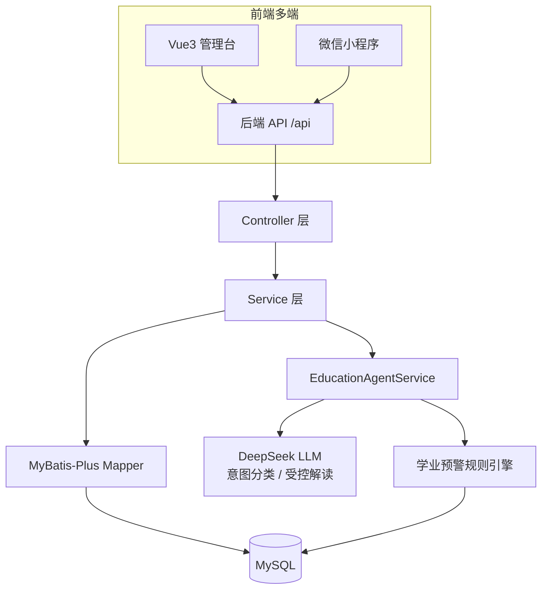
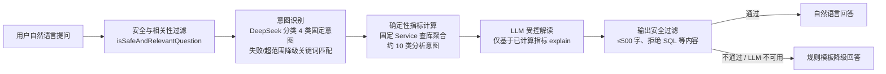

# 毕业设计论文提纲
## 《基于 AI Agent 的高校教务系统数据智能分析与学业预警系统设计与实现》

> 拟定依据：GitHub 项目 `WW1801/smart-campus-education`（校园教务系统）。
> 题目已将原题"血液预警"修正为"**学业预警**"——代码库中存在 `AcademicWarningRuleEngine`、`AcademicWarningRecord` 等完整学业预警模块，"血液/学业"为同音错别字。
> 学位层次：本科毕业设计｜引用规范：GB/T 7714｜交付物：章节级详细提纲（修订版）
> ✅ **修订记录（2026-08-29，依据代码库逐项核对）**：① Agent 架构表述改为与代码一致的"受控接地"架构（意图识别 + 确定性计算 + LLM 受控解读），**删除**与代码不符的 ReAct 工具调用/多轮对话描述；② 修正数字：控制器 23 个 / 端点 135 个、21 张表 / 22 个实体类、5 条预警规则、高/中/低三级风险；③ 补充前端测试（Vitest + Playwright）、ECharts、DeepSeek 具体模型配置；④ 诚信警示补漏 B-06。
> ✅ **修订记录二（2026-08-29，交叉验证后）**：经独立核验并本地逐条复测确认，README 的“已知问题 B-01~B-06”表为旧版遗留；当前代码中 B-01 契约一致、B-02 的 courseId 可选、B-03 为真实统计聚合、B-04 权限树真实保存、B-05 为约束排课、B-06 具备教学计划 CRUD。正文以代码和实际测试记录为准，7.3 仅写真实局限。
> ⚠️ **复核记录（2026-09-01）**：GitHub `main`（`9f8d523`）在 `AttendanceController`、`GradeController` 与 `StudentCourseSelectionServiceImpl` 中仍有 30 处中文乱码；该问题影响接口提示文本，不改变本提纲的业务架构结论。详见同目录《论文提纲与编码核查报告-20260901.md》。
> 本科定位提醒：重实现与工程完整性，创新点须**可演示、可辩护**（答辩老师会现场追问代码）。

---

## 〇、摘要（中英文）要点

- **中文摘要（约 300–400 字）**：背景（高校教务数据孤岛、学业风险发现滞后）→ 目的（构建一体化智能教务平台）→ 方法（前后端分离架构 + DeepSeek 大模型驱动的数据分析助手〔意图识别 + 确定性指标计算 + 受控解读〕+ 规则引擎学业预警）→ 结果（实现 23 个控制器、135 个接口，自然语言问答覆盖约 10 类分析意图，5 条预警规则、高/中/低三级风险分级）→ 结论（提升教务效率与学业风险识别时效性）。
- **英文摘要（Abstract）**：对应翻译，术语统一（AI Agent / academic early-warning / educational data mining / grounded generation）。
- **关键词（3–5 个）**：教务系统；人工智能代理；教育数据挖掘；学业预警；数据智能分析。

---

## 第一章 绪论

### 1.1 研究背景与意义
- 高校教务信息化现状：业务系统多但数据分散、缺乏统一分析视角。
- 痛点：学业风险（挂科、掉队）发现滞后，依赖人工经验。
- 大模型（LLM）为"用自然语言驱动数据分析"提供新可能，但直接生成存在幻觉风险，需要工程化的受控架构。
- 本系统意义：把分散的教务数据转化为可干预的预警与决策支持。
- 📁 素材：`docs/需求规格说明书.md`、`PRODUCT.md`

### 1.2 国内外研究现状
- **教务管理系统**：从 C/S 到 B/S 到前后端分离演进。
- **教育数据挖掘（EDM）与学习分析（LA）**：Romero & Ventura 综述、Siemens 学习分析定义。
- **学业预警**：规则阈值法 → 机器学习预测（掉队/流失预测）→ 早期预警系统（Early Alert）。
- **LLM 在垂直领域应用**：ReAct 推理-行动范式、Toolformer 工具调用，以及"LLM 仅做受控解读"的接地（grounding）思路。
- 研究空白小结：将"LLM 自然语言分析"与"可解释规则预警"结合落地到教务场景的研究较少；自由 Agent 存在幻觉与数据安全风险，垂直场景需要受限架构。
- 📁 文献见文末参考文献 [1]–[3]、[6]–[7]。

### 1.3 研究内容与目标
- 目标：设计并实现一套集教务管理、AI 数据智能分析、学业预警于一体的系统。
- 三大内容：① 教务业务数字化；② 基于 LLM 的数据分析助手（意图识别 + 受控解读）；③ 学业预警规则引擎。

### 1.4 论文组织结构
- 简述各章安排（绪论→技术→需求→设计→实现→测试→总结）。

---

## 第二章 相关技术与理论基础

### 2.1 系统开发技术栈
- 后端：Spring Boot 2.7.18、MyBatis-Plus 3.5.3.2、Spring Security 5.8、JWT（jjwt 0.11.5）、Redis。
- 前端：Vue 3.4、Element Plus、Vuex 4、Vite、Axios、**ECharts 5**（指标与趋势可视化）；设计系统见 `DESIGN.md`。
- 小程序：微信小程序原生（`miniprogram/`）。
- 部署：Docker / docker-compose、Nginx 反向代理。
- ⚠️ 写作注意：本项目源码目录为**自定义的 `backend/main/java`**（pom.xml 中 `sourceDirectory` 配置），测试位于标准 `backend/src/test/java`；论文中的路径描述与截图须与实际一致，勿写成标准 `src/main/java`。
- 📁 `backend/pom.xml`、`frontend/`、`nginx.conf`、`docker-compose.yml`、`DESIGN.md`

### 2.2 大模型（LLM）与受限 Agent 架构
- LLM 基本能力边界与**幻觉问题**（重点铺垫，为本项目架构选型埋伏笔）。
- 研究背景：**ReAct 范式**（推理轨迹 + 行动 + 观察循环）[1]、**Toolformer 工具调用** [5]——作为领域背景介绍，**不声称本项目实现了它们**。
- **本项目实际采用的“受控接地”（grounded generation）架构**：LLM 不直接访问数据库，只承担固定意图集合分类和对**后端已计算指标**的自然语言解读；输出经安全过滤，不可用时自动降级。该架构约束事实来源并降低事实性幻觉风险，但不能宣称完全消除模型表述错误。
- 提示词工程（Prompt Engineering）、输出约束与安全过滤、降级设计。
- 本项目 LLM 基座：**DeepSeek**（`application.yml`：`model: deepseek-v4-flash`，`base-url: https://api.deepseek.com`，api-key 经环境变量注入）[4]，理由：中文与推理能力强、成本低、接口可控。
- 📁 `service/llm/LlmClient.java`、`service/llm/impl/DeepSeekLlmClient.java`、`docs/api/agent-api.md`

### 2.3 教育数据挖掘与学习分析
- EDM 典型任务：分类、聚类、回归、关联、趋势预测 [2]。
- 学习分析闭环（Clow 学习分析循环：数据→指标→干预）[7]。
- 本系统落点：成绩趋势、班级/学期指标概览、自然语言问答式分析（对应 EDM 的描述性统计 + 趋势分析任务）。
- 📁 `dto/agent/EducationMetricsOverviewDTO.java`、`SemesterGradeTrendDTO.java`、`StudentGradeTrendDTO.java`、`EducationAnalysisQuestion*DTO.java`

### 2.4 学业预警模型与方法
- 阈值/规则法（可解释、可审计）vs 机器学习法（预测力高但黑箱）。
- 本系统采用**确定性规则引擎 + LLM 受控归因**的混合策略：规则判定风险（可解释、可审计），LLM 仅在受控范围内生成自然语言解读与干预建议。
- 📁 `service/agent/AcademicWarningRuleEngine.java`、`AcademicWarningRule.java`、`AcademicWarningAssessment.java`、`AcademicWarningContext.java`、`RuleEvaluation.java`

### 2.5 本章小结

---

## 第三章 系统需求分析

### 3.1 业务背景与用户角色
- 五类角色：校园管理员、教务处、辅导员、教师、学生（来自 `PRODUCT.md`）。
- 角色权限决定可见功能（RBAC）。
- 📁 `entity/Role.java`、`Permission.java`、`RolePermission.java`、`config/SecurityConfig.java`

### 3.2 功能性需求
- 教务管理：学生/教师/课程/排课/选课/成绩/考勤/请假/毕业审核/系统基础数据。
- AI 数据分析：指标概览、成绩趋势、**单轮自然语言问答**（约 10 类分析意图：教务概览、成绩、考勤、课程负载、学业风险、成绩趋势、不及格课程、考勤异常、学生对比、专业统计）。
- 学业预警：规则评估、预警生成、预警处理与跟踪。
- ⚠️ 表述须与代码一致：问答为**单轮**（请求携带筛选上下文，无会话历史字段）；不要写"多轮对话""工具编排"。
- 📁 各 `controller/*`、`service/*`、`docs/需求规格说明书.md`

### 3.3 非功能性需求
- 性能、安全性（JWT + 访问控制 `StudentAccessGuard`；**Agent 全部 16 个接口仅管理员角色可访问**）、可维护性、可扩展性、**LLM 不可用时系统可用性（降级）**。

### 3.4 用例分析
- 绘制核心用例图（管理员/教师/学生视角）。

### 3.5 可行性分析
- 技术可行性（技术栈成熟）、经济/操作可行性。

---

## 第四章 系统总体设计

### 4.1 设计原则与总体架构
- 前后端分离、RESTful、统一响应 `{code,message,data}`。
- 整体架构：**Web 管理台 + 微信小程序**（多端）↔ 统一后端 API ↔ 数据库/LLM。
- 📁 `AGENTS.md`（架构说明）、`README.md`

### 4.2 功能模块设计
- 模块划分图：教务管理模块、AI 分析模块、学业预警模块、Agent 助手模块、系统管理模块。
- 📁 对照 `controller/` **23 个控制器类、135 个方法级端点**（其中 `EducationAgentController` 16 个端点，仅管理员可访问）。

### 4.3 数据库设计
- E-R 图；**schema.sql 共 21 张表**（`entity/` 下 22 个实体类——`Schedule` 为 `CourseSchedule` 的同表兼容子类，映射同一张 `course_schedule` 表，论文中说明即可）。
- 关键表：Student、Course、Grade、Attendance、LeaveRequest、GraduationAudit、**AcademicWarningRecord**（学业预警记录）。
- 设计要点：雪花算法 `assign_id` 主键、手动初始化（`spring.sql.init.mode=never`）。
- 📁 `backend/db/schema/schema.sql`、`backend/db/seed/seed.sql`、`backend/db/migrations/`、`docs/database/database.md`

### 4.4 接口与交互设计
- 统一响应格式、JWT 鉴权、Vuex（localStorage）持久化 + Axios 拦截器、前端路由角色守卫。
- 📁 `common/Result.java`、`common/JwtUtils.java`、`frontend/router/`、`frontend/store/index.js`

### 4.5 AI 数据分析助手架构设计（重点小节，表述须与代码一致）
- **术语界定**：论文中的"Agent"指**受限智能体**——具备意图识别与受控解读能力，不涉及自由工具调用；此界定写在 2.2 与本节，答辩被追问时以此回应。
- 真实处理流程（五步）：

- 设计动机：通过固定数据源、输出过滤和降级链路**降低事实性幻觉风险**，同时保证 LLM 不可用时核心分析仍可用（关键词意图 + 模板回答双降级）。
- 📁 `EducationAgentController.java`（16 个端点）、`EducationAgentServiceImpl.java`（72.4 KB / 1467 行）

### 4.6 学业预警引擎设计
- 规则建模：`AcademicWarningRule`（条件/阈值）→ `RuleEvaluation` 评估 → `AcademicWarningAssessment` 生成评估 → 写入 `AcademicWarningRecord`。
- **5 条规则（ID / 级别 / 风险分）**：① `GRADE_FAILED_MULTI` 不及格 ≥2 门（high/40）；② `GRADE_FAILED_SINGLE` 不及格 =1 门（medium/25）；③ `ATTENDANCE_ABSENT_3` 缺勤 ≥3 次（medium/30）；④ `GRADUATION_REJECTED` 毕业审核未通过（high/40）；⑤ `COMBINED_GRADE_ATTENDANCE_GRADUATION` 成绩+考勤+毕业审核组合风险（high/20）。每条规则内置**干预建议文案**（如"安排辅导员和任课教师联合约谈"）。
- **风险分级：high / medium / low 三级**（多规则命中取最高级），风险分累加后**封顶 100**。⚠️ 勿写"红/橙/黄"。
- 流程：数据采集 → 规则匹配 → 风险分级 → 生成预警 → 责任人处理跟踪（`ProcessUpdate` 闭环）。
- 📁 `service/agent/*`、`entity/AcademicWarningRecord.java`、`dto/agent/AcademicWarning*DTO.java`、`backend/db/migrations/20260728_academic_warning_record.sql`

### 4.7 本章小结

---

## 第五章 系统详细设计与实现

### 5.1 开发环境与配置
- JDK 8（pom 编译目标）；Maven 3.6+；Node 18+；MySQL 8；Redis（可选）。
- ⚠️ 源码目录为自定义 `backend/main/java`（见 2.1 注意事项）。
- 📁 `.env.example`、`README.md` 快速启动。

### 5.2 后端核心实现
- 分层架构、统一异常处理（`GlobalExceptionHandler`）、操作日志切面（`OperationLogAspect`）、学生数据访问守卫（`StudentAccessGuard`）、学号解析（`StudentNoResolver`）。
- **自动排课算法**（`ScheduleServiceImpl.autoArrange`，真实实现，**可作亮点单独成段**）：学期级悲观锁（`semesterMapper.lockById`）防并发 → 载入已占用课表 → 逐任务合法性校验 → 教室容量校验（`requiredCapacity`）→ 时段×教室可用性检测 → 输出成功/失败明细（successes/failures）。
- **基于角色的权限分配**（`RoleController.assignPermissions`）：先删后插（delete + 逐条 insert）保证幂等，真实落库 `role_permission` 表。
- 📁 `common/*`、`config/*`、`service/impl/*`

### 5.3 AI 数据分析助手实现（重点章节，按真实架构写）
- `EducationAgentServiceImpl`（1467 行）：
  - **意图识别与三级路由**：成绩趋势/专业统计两类直接关键词路由；其余优先 `LlmClient.recognizeIntent`（DeepSeek 仅能返回 overview/grade/attendance/course_load 四类固定意图，见接口 Javadoc），失败降级关键词匹配 `resolveIntent`；
  - **确定性指标计算**：各意图分支调用固定 Service 查库聚合（成绩、考勤、课程负载、学业风险、不及格课程、考勤异常、学生对比等）；
  - **LLM 受控解读**：`llmClient.explain` 仅基于已计算 metrics 生成解读；
  - **安全过滤与降级链路**：`isSafeLlmExplanation`（长度 ≤500 字、拒绝 SQL/DDL 关键词）→ 不通过或 LLM 异常时回退规则模板 `fallbackAnswer`。
- `DeepSeekLlmClient`：对接 `api.deepseek.com`（模型 deepseek-v4-flash）、请求/响应解析、api-key 环境变量注入、超时与降级。
- 📁 `service/llm/*`、`service/impl/EducationAgentServiceImpl.java`、`docs/api/agent-api.md`

### 5.4 学业预警模块实现（重点章节）
- 规则引擎执行流程（5 条规则、高/中/低三级、风险分封顶 100）、预警记录 CRUD 与处理闭环（`ProcessUpdate`）。
- 与 LLM 协同：规则给出"谁有风险、为什么"（命中规则与阈值事实），LLM 在受控范围内生成自然语言解读与干预建议（个人事实由固定查询组装，不交给模型补写）。
- 📁 `service/agent/*`、`service/impl/AcademicWarningRecordServiceImpl.java`

### 5.5 数据智能分析实现
- 指标概览聚合、学期/学生成绩趋势计算、单轮自然语言问答式分析（按 4.5/5.3 受控流程实现）；前端以 ECharts 呈现概览与趋势。
- **考勤多维统计**（`/attendance/statistics`）：按学期/课程可选过滤，真实聚合出勤/迟到/早退/缺勤/请假计数与出勤率，含近 7 日出勤率趋势。
- 📁 `dto/agent/EducationMetricsOverviewDTO.java` 等、`EducationAgentService` 各分析分支、`frontend/views/analysis/`、`frontend/views/agent/`

### 5.6 前端与管理台实现
- Vue3 + Element Plus + Vuex + ECharts；基于角色的路由守卫；`DESIGN.md` 设计系统（深墨蓝侧栏、状态双编码、44px 触控目标）。
- 📁 `frontend/`、`DESIGN.md`

### 5.7 微信小程序实现
- 学生端 5 个页面：login（登录）、schedule（课表）、grades（成绩）、leave（请假）、profile（个人中心）——移动端查询/提醒入口；不含 AI 分析功能（如实写）。
- 📁 `miniprogram/`

### 5.8 关键技术难点与解决
- ① LLM 幻觉控制：受控接地架构（模型只解读已计算指标 + 输出安全过滤），而非依赖提示词约束；② 可用性降级：LLM 不可用时关键词意图 + 模板回答，核心分析功能不中断；③ 规则与 LLM 分工：确定性判定与自然语言解读解耦；④ 细粒度权限隔离：学生仅看自己数据（`StudentAccessGuard`）、Agent 接口仅管理员。

> ✅ **学术诚信提示（2026-08-29 已逐条核实代码）**：`README.md` 的"已知问题 B-01~B-06"表是**旧版遗留文档**，对应模块在当前代码中**均已真实实现**，论文不得照抄文档自曝其短：
> - B-01 学籍状态：前端 `Info.vue` 实际发送 `status: targetStatus.value`（`targetStatus` 只是组件内变量名），后端 `PUT /{id}/status` 读 `params.get("status")`——**契约一致**；
> - B-02 考勤统计 `courseId` 已可选（`required = false`）；
> - B-03 考勤统计已为真实数据库聚合（含近 7 日趋势），非硬编码；
> - B-04 权限树保存已真实落库（先删后插）；
> - B-05 自动排课已是真实约束排课（见 5.2，**可作论文亮点**）；
> - B-06 教学计划已具备完整 CRUD（`TeachingPlanController`：/page、/list、/{id}、POST、PUT、DELETE）。
> **写作要求**：正文一律**以代码为准**；文档与代码不一致处（如 README 旧表）正文不必提，可在 7.3 反思一句"文档更新滞后于代码迭代"。

---

## 第六章 系统测试

### 6.1 测试环境
- 本地 MySQL + Docker；后端 JUnit 5 + Mockito（经 `ReflectionTestUtils` 注入，无 Spring 测试切片注解，见 README）；前端 Vitest + Playwright。

### 6.2 功能测试
- 各业务模块功能用例（含 Agent 问答、预警触发与处理）。
- **前端 e2e（Playwright，5 个 spec）**：auth（认证）、admin-shell（管理台框架）、grade-workflow（成绩录入）、leave-workflow（请假审批）、teaching-workflows（教学流程）。

### 6.3 接口与单元测试
- **后端共 23 个测试类**（`backend/src/test/java/`），论文重点介绍：`AcademicWarningRuleEngineTest`、`AcademicWarningRecordServiceImplTest`、`EducationAgentServiceImplTest`、`DeepSeekLlmClientTest`、`StudentAccessGuardTest`、`JwtUtilsTest`、`GraduationAuditServiceImplTest`；其余覆盖控制器（Agent/Grade/Semester/User/Account）与服务（Attendance/Grade/Leave/Schedule/Semester/Student/选课学期解析/账号开通/人员生命周期）。
- **前端单测（Vitest，5 个 spec）**：router、request、navigation、dashboard、grade-input。
- 📁 `backend/src/test/java/`、`frontend/tests/`、`docs/testing/*`

### 6.4 性能与安全性测试
- 并发/响应时间、JWT 鉴权与越权防护（`StudentAccessGuard`、Agent 接口角色限制）验证。

### 6.5 测试结果与分析
- 汇总通过率与缺陷统计；"不足"以 7.3 的**真实局限**为准（B-01~B-06 经核实已修复，勿照抄 README 旧表）。

---

## 第七章 总结与展望

### 7.1 工作总结
- 完成内容回顾：23 个控制器 / 135 个接口的教务一体化平台、受控式 AI 数据分析助手（约 10 类分析意图）、5 条规则的学业预警引擎（高/中/低三级）、约束式自动排课（悲观锁 + 容量/冲突校验）、多端（Web + 小程序）。

### 7.2 主要创新点（须可辩护，对应实际代码）
1. **受控接地的大模型数据分析架构**：LLM 不接触数据库，仅承担固定意图分类与对已计算指标的受控解读；配合输出安全过滤与双级降级，约束事实来源并降低事实性幻觉风险。可现场演示“关闭 LLM 后系统仍以降级模式返回结果”。
2. **规则引擎 + LLM 协同**的学业预警机制：确定性规则（5 条规则、高/中/低三级、风险分封顶 100）保证可解释、可追溯，LLM 负责自然语言解读与归因建议，个人事实不由模型补写。
3. 前后端分离 + 多端（Web 管理台 + 微信小程序）统一数据服务的教务一体化平台。

### 7.3 不足与改进方向（真实局限，经得起追问）
- 学业预警为 5 条静态规则，属**事后判定**，未引入机器学习模型做**事前预测**（改进方向：掉队/流失预测）。
- Agent 为**单轮问答**，无会话记忆与多轮追问能力。
- 强依赖外部 LLM API：存在网络延迟、调用成本与可用性风险（已有关键词意图 + 模板回答降级，但降级模式不覆盖语义解读质量）。
- 自动排课为**贪心策略**，未做多目标优化（教师时间偏好、教室利用率均衡等）。
- 小程序端仅 5 个学生页面，不含 AI 分析能力。
- 展望：扩展为多轮对话与工具调用（ReAct）、接入 RAG 检索校内制度文档、引入机器学习预警模型。

---

## 参考文献（写作定稿前逐条复核出处、DOI 与引用格式）

[1] YAO S, ZHAO J, YU D, et al. ReAct: Synergizing Reasoning and Acting in Language Models[C]//Proceedings of ICLR 2023. 2023. (arXiv:2210.03629)

[2] ROMERO C, VENTURA S. Educational data mining: a review of the state of the art[J]. IEEE Transactions on Systems, Man, and Cybernetics, Part C, 2010, 40(6): 601-618. DOI:10.1109/TSMCC.2010.2053532.

[3] SIEMENS G, LONG P. Penetrating the fog: analytics in learning and education[J]. EDUCAUSE Review, 2011, 46(5): 30-40.

[4] DEEPSEEK-AI. DeepSeek LLM: Scaling Open-Source Language Models with Longtermism[EB/OL]. (2024-01-05)[2026-08-26]. https://arxiv.org/abs/2401.02954.

[5] SCHICK T, DWIVEDI-YU J, DESSÌ R, et al. Toolformer: Language Models Can Teach Themselves to Use Tools[C]//Advances in Neural Information Processing Systems 36 (NeurIPS 2023). 2023: 68539-68551. (arXiv:2302.04761)

### 建议补充（写作时逐条核验 DOI/出处，勿直接照抄）
- [6] ARNOLD K E, PISTILLI E M. Course Signals at Purdue: Using Learning Analytics to Increase Student Success[C]//Proceedings of the 2nd International Conference on Learning Analytics and Knowledge (LAK'12). 2012: 267-270.（早期预警代表案例）
- [7] CLOW D. The Learning Analytics Cycle: Closing the Loop Effectively[C]//Proceedings of LAK'12. 2012: 134-138.
- [8] BAKER R S, YACEF K. The state of educational data mining in 2009: a review and future visions[J]. Educational Data Mining, 2009, 1(1): 1-15.
- 中文文献：在 CNKI 检索"学业预警系统 / 高校教务 / 教育数据挖掘"相关**核心期刊或硕士学位论文** 3–5 篇（需校园网/CNKI 核验真实存在后再引用）。

---

## 附录（建议）
- 附录 A：核心数据库表结构（`schema.sql` 节选）
- 附录 B：关键接口清单（23 个控制器 / 135 个端点汇总，按模块分组）
- 附录 C：核心代码片段（意图识别与降级链路、规则引擎评估）
- 附录 D：系统界面截图（管理台 + 小程序）
- 附录 E：测试用例清单（后端 23 个测试类 + 前端 Vitest/Playwright spec 汇总）

---

## 下一步写作计划（按此顺序推进，每步独立成稿）
1. **绪论 + 文献基础**（第一章、第二章）→ 用 [1]–[5] 及补充文献；2.2 注意把 ReAct/Toolformer 定位为"研究背景"，把受控接地架构定位为"本项目选型"。
2. **需求分析**（第三章）→ 以 `需求规格说明书.md` 为骨架。
3. **总体设计**（第四章）→ 重点画架构图、E-R 图、**Agent 五步受控流程图（4.5）**、预警流程图（含 5 条规则与三级分级）。
4. **详细实现**（第五章）→ 围绕 5.3 / 5.4 两个重点章节展开代码级描述（降级链路、安全过滤是亮点），5.2 的自动排课算法单独成段。
5. **测试与总结**（第六章、第七章）→ 后端 23 个测试类 + 前端 Vitest/Playwright；"不足"写 7.3 的真实局限（B-01~B-06 已修复，勿照抄 README 旧表）。
6. **统稿**：摘要、关键词、参考文献格式校对、查重预检。

> 每完成一章，建议先交我"评审检查点"再继续，确保引用真实、章节映射代码无误、空壳模块已如实标注。
